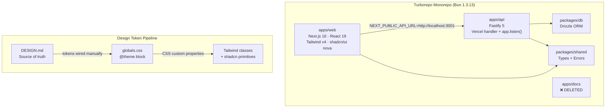
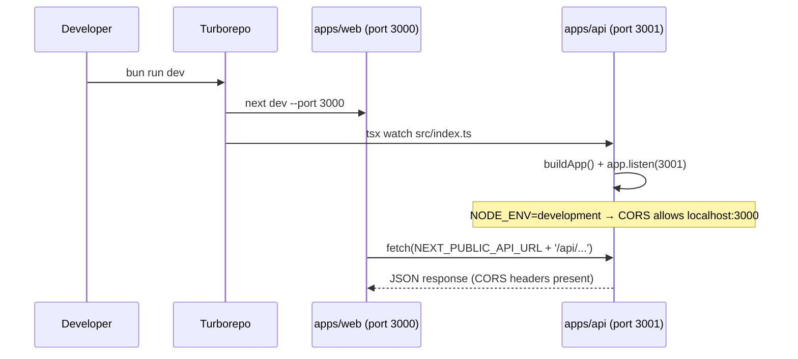
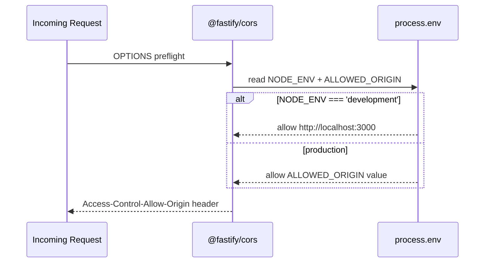

# Design Document: AmarSpace Fixes & UI Overhaul

## Overview

AmarSpace is a Bangladeshi property management platform built on a Turborepo monorepo (Bun, Next.js 16, Fastify 5). This overhaul addresses seven concrete problems: removing the unused `apps/docs` app, wiring up local dev server binding on the API, making CORS environment-aware, installing Tailwind v4 + shadcn/ui nova preset on the frontend, connecting DESIGN.md tokens into the Tailwind `@theme` block, migrating all inline `style={{}}` usage to Tailwind + shadcn components, and creating the missing `.env.local` for the web app.

The result is a codebase where the design system is expressed once (in `globals.css` `@theme`) and consumed everywhere through utility classes and shadcn primitives — no scattered inline styles, no hardcoded hex values, no broken local dev experience.

## Architecture



## Sequence Diagrams

### Local Dev Startup Flow



### CORS Environment Decision



## Components and Interfaces

### 1. API Entry Point (`apps/api/src/index.ts`)

**Purpose**: Dual-mode server — Vercel serverless handler for production, `app.listen()` for local dev.

**Interface**:
```typescript
// Vercel export (unchanged)
export default async function handler(req: Request): Promise<Response>

// Local dev — added below the export
if (process.env.NODE_ENV !== 'production') {
  const port = Number(process.env.PORT ?? 3001)
  app.listen({ port, host: '0.0.0.0' }, (err) => {
    if (err) { app.log.error(err); process.exit(1) }
    app.log.info(`API listening on http://localhost:${port}`)
  })
}
```

**Responsibilities**:
- Export the Vercel handler (warm-start reuse, unchanged)
- Conditionally call `app.listen()` when `NODE_ENV !== 'production'`
- Use `PORT` env var with fallback to `3001`

### 2. CORS Configuration (`apps/api/src/app.ts`)

**Purpose**: Environment-aware CORS — permissive in dev, locked to configured origin in prod.

**Interface**:
```typescript
app.register(fastifyCors, {
  origin: (origin, cb) => {
    const allowed =
      process.env.NODE_ENV === 'development'
        ? ['http://localhost:3000', 'http://127.0.0.1:3000']
        : [process.env.ALLOWED_ORIGIN ?? '']
    if (!origin || allowed.includes(origin)) {
      cb(null, true)
    } else {
      cb(new Error('Not allowed by CORS'), false)
    }
  },
  credentials: true,
})
```

**Responsibilities**:
- Allow `http://localhost:3000` in development
- Read `ALLOWED_ORIGIN` env var in production
- Preserve `credentials: true` for cookie-based auth

### 3. Tailwind v4 + shadcn/ui Setup (`apps/web`)

**Purpose**: Replace the missing CSS framework with Tailwind v4 and shadcn/ui nova preset.

**Installation sequence**:
```
bun add tailwindcss@next @tailwindcss/postcss@next --cwd apps/web
bun add -d postcss --cwd apps/web
bunx shadcn@latest init --preset nova --cwd apps/web
```

**`postcss.config.mjs`** (new file):
```javascript
export default {
  plugins: {
    '@tailwindcss/postcss': {},
  },
}
```

**`next.config.js`** — no changes needed; Next.js 16 auto-detects PostCSS.

### 4. Design Token `@theme` Block (`apps/web/app/globals.css`)

**Purpose**: Wire every DESIGN.md token into Tailwind v4's `@theme` block so they become first-class utility classes (e.g., `bg-brand-green`, `text-ink`, `rounded-full`).

**Interface** — `globals.css` structure:
```css
@import "tailwindcss";

@theme {
  /* ── Fonts ── */
  --font-sans: "DM Sans", "Noto Sans Bengali", Inter, system-ui, sans-serif;
  --font-mono: ui-monospace, monospace;

  /* ── Brand Colors ── */
  --color-primary:          #0a0a0a;
  --color-on-primary:       #ffffff;
  --color-primary-soft:     #181e25;
  --color-brand-green:      #1ba673;
  --color-brand-green-light:#e8ffea;
  --color-brand-blue:       #1456f0;
  --color-brand-blue-mid:   #3b82f6;
  --color-brand-blue-deep:  #1d4ed8;
  --color-brand-blue-200:   #bfdbfe;
  --color-brand-orange:     #f97316;
  --color-brand-orange-light:#fff7ed;

  /* ── Surface & Canvas ── */
  --color-canvas:           #ffffff;
  --color-surface:          #f7f8fa;
  --color-surface-soft:     #f2f3f5;
  --color-hairline:         #e5e7eb;
  --color-hairline-soft:    #eaecf0;

  /* ── Text Hierarchy ── */
  --color-ink:              #0a0a0a;
  --color-ink-strong:       #000000;
  --color-charcoal:         #222222;
  --color-slate:            #45515e;
  --color-steel:            #5f5f5f;
  --color-stone:            #8e8e93;
  --color-muted:            #a8aab2;

  /* ── Semantic ── */
  --color-success-bg:       #e8ffea;
  --color-success-text:     #1ba673;
  --color-warning-bg:       #fff7ed;
  --color-warning-text:     #c2410c;
  --color-error-bg:         #fef2f2;
  --color-error-text:       #d45656;
  --color-on-dark:          #ffffff;
  --color-footer-bg:        #0a0a0a;

  /* ── Border Radius ── */
  --radius-xs:   4px;
  --radius-sm:   6px;
  --radius-md:   8px;
  --radius-lg:   12px;
  --radius-xl:   16px;
  --radius-xxl:  20px;
  --radius-xxxl: 24px;
  --radius-full: 9999px;

  /* ── Spacing ── */
  --spacing-xxs:        4px;
  --spacing-xs:         8px;
  --spacing-sm:         12px;
  --spacing-md:         16px;
  --spacing-lg:         20px;
  --spacing-xl:         24px;
  --spacing-xxl:        32px;
  --spacing-xxxl:       40px;
  --spacing-section-sm: 48px;
  --spacing-section:    64px;
  --spacing-section-lg: 80px;
}
```

**Token → Tailwind class mapping** (examples):

| DESIGN.md token | Tailwind class |
|---|---|
| `colors.brand-green` | `bg-brand-green` / `text-brand-green` |
| `colors.hairline` | `border-hairline` |
| `colors.surface` | `bg-surface` |
| `colors.ink` | `text-ink` |
| `rounded.full` | `rounded-full` |
| `rounded.xl` | `rounded-xl` |
| `spacing.xl` | `p-xl` / `gap-xl` |

### 5. shadcn/ui Component Mapping

**Purpose**: Map existing custom UI components to shadcn primitives, keeping the AmarSpace design tokens.

| Existing component | shadcn primitive | Notes |
|---|---|---|
| `<StatusBadge>` | `<Badge>` | Keep variant logic; replace inline styles with `bg-success-bg text-success-text` etc. |
| `<FormField>` / `<FormInput>` | `<Label>` + `<Input>` | shadcn Input already uses `rounded-md border-hairline` pattern |
| `<LoadingSkeleton>` | `<Skeleton>` | Direct replacement |
| `<ConfirmDialog>` | `<AlertDialog>` | Wrap existing logic |
| `<DataTable>` | `<Table>` | Keep column definitions; replace inline styles |
| Login/Register submit button | `<Button variant="default">` | `rounded-full bg-primary text-on-primary` |
| Sidebar nav items | `<Button variant="ghost">` | Active state: `bg-surface text-ink` |
| Stat cards | `<Card>` | `bg-surface rounded-lg p-lg` |
| Error feedback | `<Alert>` | `bg-error-bg text-error-text` |

### 6. Inline Style Migration Pattern

**Purpose**: Systematic replacement of `style={{}}` props with Tailwind utility classes.

**Before** (owner-dashboard.tsx):
```tsx
<div style={{
  padding: '1.25rem',
  backgroundColor: '#ffffff',
  borderRadius: '0.75rem',
  border: '1px solid #e5e7eb',
  boxShadow: '0 1px 2px rgba(0,0,0,0.05)',
}}>
```

**After**:
```tsx
<Card className="p-lg rounded-xl border border-hairline shadow-sm">
```

**Before** (login/page.tsx):
```tsx
<button style={{
  minHeight: '44px',
  backgroundColor: '#2563eb',
  borderRadius: '0.375rem',
  fontWeight: 600,
  color: '#ffffff',
}}>
```

**After**:
```tsx
<Button className="w-full min-h-[44px] rounded-full bg-primary text-on-primary font-semibold">
```

**Before** (status-badge.tsx):
```tsx
style={{
  backgroundColor: '#dcfce7',
  color: '#166534',
  borderRadius: '9999px',
  padding: '0.25rem 0.625rem',
}}
```

**After**:
```tsx
<Badge className="bg-success-bg text-success-text rounded-full px-[10px] py-1">
```

### 7. Environment File (`apps/web/.env.local`)

**Purpose**: Point the frontend at the local API server during development.

```bash
NEXT_PUBLIC_API_URL=http://localhost:3001
```

This file is gitignored (`.env.local` is in Next.js's default `.gitignore`). The existing `.env.example` documents the variable.

## Data Models

### Environment Variables

**`apps/api` (server-side)**:
```typescript
interface ApiEnv {
  NODE_ENV: 'development' | 'production' | 'test'
  PORT?: string              // defaults to 3001
  ALLOWED_ORIGIN?: string    // required in production
  DATABASE_URL: string
  BETTER_AUTH_SECRET: string
  // ... existing vars unchanged
}
```

**`apps/web` (client-side)**:
```typescript
interface WebEnv {
  NEXT_PUBLIC_API_URL: string  // http://localhost:3001 in dev
}
```

### shadcn/ui Configuration (`components.json`)

```json
{
  "$schema": "https://ui.shadcn.com/schema.json",
  "style": "nova",
  "rsc": true,
  "tsx": true,
  "tailwind": {
    "config": "",
    "css": "app/globals.css",
    "baseColor": "neutral",
    "cssVariables": true
  },
  "aliases": {
    "components": "@/components",
    "utils": "@/lib/utils",
    "ui": "@/components/ui",
    "lib": "@/lib",
    "hooks": "@/hooks"
  }
}
```

## Algorithmic Pseudocode

### CORS Origin Resolver

```pascal
PROCEDURE resolveCorsOrigin(origin, callback)
  INPUT: origin (string | undefined), callback (function)
  OUTPUT: void (calls callback with allow/deny)

  SEQUENCE
    IF process.env.NODE_ENV = 'development' THEN
      allowedOrigins ← ['http://localhost:3000', 'http://127.0.0.1:3000']
    ELSE
      allowedOrigins ← [process.env.ALLOWED_ORIGIN]
    END IF

    IF origin IS NULL OR origin IN allowedOrigins THEN
      callback(null, true)
    ELSE
      callback(new Error('Not allowed by CORS'), false)
    END IF
  END SEQUENCE
END PROCEDURE
```

**Preconditions:**
- `process.env.NODE_ENV` is set
- In production, `ALLOWED_ORIGIN` is a non-empty string

**Postconditions:**
- `callback` is called exactly once
- In development, same-origin requests (no `origin` header) are always allowed
- In production, only the configured origin is allowed

### Local Dev Server Bootstrap

```pascal
PROCEDURE bootstrapLocalServer(app)
  INPUT: app (Fastify instance)
  OUTPUT: void

  SEQUENCE
    IF process.env.NODE_ENV ≠ 'production' THEN
      port ← parseInt(process.env.PORT ?? '3001')

      app.listen({ port: port, host: '0.0.0.0' }, (err) => {
        IF err ≠ null THEN
          app.log.error(err)
          process.exit(1)
        END IF
        app.log.info('API listening on http://localhost:' + port)
      })
    END IF
  END SEQUENCE
END PROCEDURE
```

**Preconditions:**
- `app` is a fully configured Fastify instance (plugins registered)
- `NODE_ENV` is set in the environment

**Postconditions:**
- In non-production: server binds to `0.0.0.0:PORT`
- In production: no-op (Vercel handler manages lifecycle)
- On bind error: process exits with code 1

### Inline Style Migration Algorithm

```pascal
PROCEDURE migrateInlineStyles(componentFile)
  INPUT: componentFile (TSX source file)
  OUTPUT: migrated TSX source file

  SEQUENCE
    FOR each style={{...}} occurrence IN componentFile DO
      properties ← extractStyleProperties(occurrence)
      tailwindClasses ← []

      FOR each property IN properties DO
        IF property.name = 'backgroundColor' THEN
          tailwindClasses.add(mapColorToToken(property.value, 'bg'))
        ELSE IF property.name = 'color' THEN
          tailwindClasses.add(mapColorToToken(property.value, 'text'))
        ELSE IF property.name = 'borderRadius' THEN
          tailwindClasses.add(mapRadiusToToken(property.value))
        ELSE IF property.name = 'padding' THEN
          tailwindClasses.add(mapSpacingToToken(property.value, 'p'))
        ELSE IF property.name = 'fontSize' THEN
          tailwindClasses.add(mapFontSizeToToken(property.value))
        ELSE IF property.name = 'fontWeight' THEN
          tailwindClasses.add(mapFontWeightToToken(property.value))
        ELSE IF property.name = 'minHeight' THEN
          tailwindClasses.add('min-h-[' + property.value + ']')
        ELSE IF property.name = 'border' THEN
          tailwindClasses.add(mapBorderToToken(property.value))
        END IF
      END FOR

      replaceStylePropWithClassName(occurrence, tailwindClasses.join(' '))
    END FOR

    RETURN migrated componentFile
  END SEQUENCE
END PROCEDURE
```

**Loop Invariants:**
- All previously processed `style={{}}` occurrences have been replaced with `className` equivalents
- No hardcoded hex values remain in processed occurrences

## Key Functions with Formal Specifications

### `buildApp()` — CORS registration update

```typescript
function buildApp(opts: Record<string, unknown> = {}): FastifyInstance
```

**Preconditions:**
- `process.env.NODE_ENV` is defined
- In production: `process.env.ALLOWED_ORIGIN` is a non-empty string

**Postconditions:**
- Returns a configured Fastify instance
- CORS plugin registered with environment-aware origin function
- All existing plugins and routes remain registered

**Loop Invariants:** N/A

### `handler()` — Vercel serverless export (unchanged)

```typescript
export default async function handler(req: Request): Promise<Response>
```

**Preconditions:**
- `app` module-level instance is initialized
- `app.ready()` is idempotent

**Postconditions:**
- Returns a `Response` with correct status, headers, and body
- `x-request-id` header present in response

### Token mapping functions (design system)

```typescript
function mapColorToToken(hexValue: string, prefix: 'bg' | 'text' | 'border'): string
```

**Preconditions:**
- `hexValue` is a valid CSS hex color string
- `prefix` is one of `'bg'`, `'text'`, `'border'`

**Postconditions:**
- Returns a Tailwind utility class string using a DESIGN.md token name
- If no token match found, returns an arbitrary value class: `${prefix}-[${hexValue}]`

## Example Usage

### Running local dev after changes

```bash
# From monorepo root
bun run dev
# → apps/web starts on http://localhost:3000
# → apps/api starts on http://localhost:3001
# CORS allows localhost:3000 → localhost:3001 requests
```

### Using design tokens in a new component

```tsx
// Before (inline styles — forbidden after migration)
<div style={{ backgroundColor: '#1ba673', borderRadius: '9999px', padding: '4px 10px' }}>
  Active
</div>

// After (Tailwind tokens from @theme)
<Badge className="bg-brand-green text-on-dark rounded-full px-[10px] py-1">
  Active
</Badge>
```

### Stat card using shadcn Card + design tokens

```tsx
import { Card, CardContent } from '@/components/ui/card'

function StatCard({ label, value }: { label: string; value: string }) {
  return (
    <Card className="bg-surface rounded-lg border-hairline">
      <CardContent className="p-lg">
        <p className="text-sm text-steel">{label}</p>
        <p className="text-2xl font-bold text-ink mt-1">{value}</p>
      </CardContent>
    </Card>
  )
}
```

### Environment-aware API URL in frontend

```typescript
// apps/web/lib/api.ts
const BASE_URL = process.env.NEXT_PUBLIC_API_URL ?? 'http://localhost:3001'

export async function apiFetch(path: string, init?: RequestInit) {
  return fetch(`${BASE_URL}${path}`, {
    credentials: 'include',
    ...init,
  })
}
```

## Correctness Properties

*A property is a characteristic or behavior that should hold true across all valid executions of a system — essentially, a formal statement about what the system should do. Properties serve as the bridge between human-readable specifications and machine-verifiable correctness guarantees.*

### Property 1: No inline styles remain after migration

For all TSX files in `apps/web/components/**/*.tsx` and `apps/web/app/**/*.tsx`, no `style={{` prop exists after the migration is complete.

**Validates: Requirements 6.1**

### Property 2: No raw hex literals outside globals.css

For all color values in migrated component files, no raw hex literals matching `#[0-9a-fA-F]{3,6}` appear — all colors are expressed through Tailwind token classes derived from the `@theme` block in `globals.css`.

**Validates: Requirements 5.2, 6.2**

### Property 3: 44px touch targets on all interactive elements

For all interactive elements (buttons, links, nav items) in migrated components, a `min-h-[44px]` or `min-h-11` class is present, satisfying the DESIGN.md 44px minimum touch target requirement.

**Validates: Requirements 6.10**

### Property 4: Pill shape on all buttons and badges

For all `<Button>` and `<Badge>` elements in migrated components, the `rounded-full` class is present — the pill shape is a non-negotiable system signature per DESIGN.md.

**Validates: Requirements 6.3, 6.4**

### Property 5: CORS allows localhost only in development

For the CORS origin resolver: any origin string that is not `http://localhost:3000` or `http://127.0.0.1:3000` is rejected when `NODE_ENV === 'development'`. In production, only the value of `ALLOWED_ORIGIN` is permitted.

**Validates: Requirements 3.1, 3.2, 3.3, 3.4, 3.6**

### Property 6: Local dev server binds only outside production

`app.listen()` is called if and only if `NODE_ENV !== 'production'`. The Vercel handler export is always present regardless of environment.

**Validates: Requirements 2.1, 2.2, 2.3**

### Property 7: apps/docs is fully removed

After deletion, the `apps/docs` directory does not exist and is not referenced in any `turbo.json`, `package.json` workspace glob, import statement, comment, or string literal.

**Validates: Requirements 1.1, 1.2, 1.3, 1.4**

### Property 8: Frontend env file points to local API

`apps/web/.env.local` exists and contains `NEXT_PUBLIC_API_URL=http://localhost:3001`, enabling the frontend to reach the local API server during development.

**Validates: Requirements 7.1**

## Error Handling

### Scenario 1: CORS rejection in production

**Condition**: Request arrives from an origin not matching `ALLOWED_ORIGIN`
**Response**: `@fastify/cors` returns HTTP 400 with CORS error; no route handler is invoked
**Recovery**: Operator sets correct `ALLOWED_ORIGIN` env var and redeploys

### Scenario 2: API server fails to bind port 3001

**Condition**: Port 3001 already in use during local dev
**Response**: Fastify logs the error and `process.exit(1)` is called
**Recovery**: Developer kills the conflicting process or sets `PORT=3002` in `.env`

### Scenario 3: Tailwind token not found for a hex value

**Condition**: A hex color in an inline style has no corresponding DESIGN.md token
**Response**: Migration uses an arbitrary value class `bg-[#hexvalue]` as a fallback
**Recovery**: Add the missing token to the `@theme` block in `globals.css`

### Scenario 4: shadcn init conflicts with existing component names

**Condition**: `bunx shadcn init` tries to write a file that already exists (e.g., `components/ui/button.tsx`)
**Response**: shadcn CLI prompts to overwrite; existing custom logic must be preserved
**Recovery**: Review diff, keep custom variants, merge shadcn base styles

### Scenario 5: `NEXT_PUBLIC_API_URL` missing in production

**Condition**: `.env.local` not deployed; env var not set in Vercel dashboard
**Response**: `apiFetch` falls back to `http://localhost:3001` which fails in production
**Recovery**: Set `NEXT_PUBLIC_API_URL` in the Vercel project environment variables

## Testing Strategy

### Unit Testing Approach

- CORS origin resolver: unit test with `(origin, cb)` pairs covering dev/prod/missing-origin cases
- Token mapping functions: unit test each hex → Tailwind class mapping
- `buildApp()`: verify CORS plugin is registered with correct options per `NODE_ENV`

### Property-Based Testing Approach

**Property Test Library**: `fast-check` (already installed in `apps/api/devDependencies`)

**Properties to test**:
1. For any `origin` string not in the allowed list, `resolveCorsOrigin` always calls `cb` with an error in production
2. For any `origin` matching `http://localhost:3000`, `resolveCorsOrigin` always calls `cb(null, true)` in development
3. For any valid hex color in DESIGN.md, `mapColorToToken` returns a string containing no raw hex literals

### Integration Testing Approach

- Start API with `NODE_ENV=development`, send a request from `http://localhost:3000` origin, assert `Access-Control-Allow-Origin: http://localhost:3000` in response headers
- Start API with `NODE_ENV=production` and `ALLOWED_ORIGIN=https://amarspace.com`, send request from `http://localhost:3000`, assert CORS rejection

### Visual Regression Approach

- After migration, run Storybook (or a simple screenshot test) on each migrated component to confirm visual parity with the pre-migration inline-style version
- Key components to verify: `StatusBadge`, `StatCard`, `DashboardLayout`, `LoginPage`, `Sidebar`

## Performance Considerations

- Tailwind v4 generates CSS at build time from scanned class names — no runtime overhead vs. inline styles
- Removing `apps/docs` eliminates one Next.js build from the Turborepo pipeline, reducing CI time
- shadcn components are tree-shaken; only imported primitives are bundled
- The `@theme` block in `globals.css` is processed once by PostCSS; no per-component CSS-in-JS overhead

## Security Considerations

- CORS is now locked to a specific origin in production — previously `origin: true` allowed any origin with credentials, which is a security risk for cookie-based auth
- `ALLOWED_ORIGIN` must be set as a secret env var in the deployment environment; it must not be committed to source control
- `.env.local` is gitignored by Next.js default; the `.env.example` documents the variable without a real value
- shadcn components do not introduce new network requests or third-party scripts

## Dependencies

### New dependencies — `apps/web`

| Package | Version | Purpose |
|---|---|---|
| `tailwindcss` | `^4.0.0` (next) | CSS framework |
| `@tailwindcss/postcss` | `^4.0.0` (next) | PostCSS integration for Tailwind v4 |
| `postcss` | `^8.x` | PostCSS runner |
| `@radix-ui/react-*` | (via shadcn) | Accessible UI primitives |
| `class-variance-authority` | (via shadcn) | Variant management |
| `clsx` | (via shadcn) | Class merging |
| `tailwind-merge` | (via shadcn) | Tailwind class deduplication |
| `lucide-react` | (via shadcn) | Icon set |

### New dependencies — `apps/api`

None. The local dev server change is a code-only modification to `src/index.ts`.

### Removed

| Package/App | Reason |
|---|---|
| `apps/docs` (entire directory) | Unused Next.js app; never referenced by any other workspace package |
