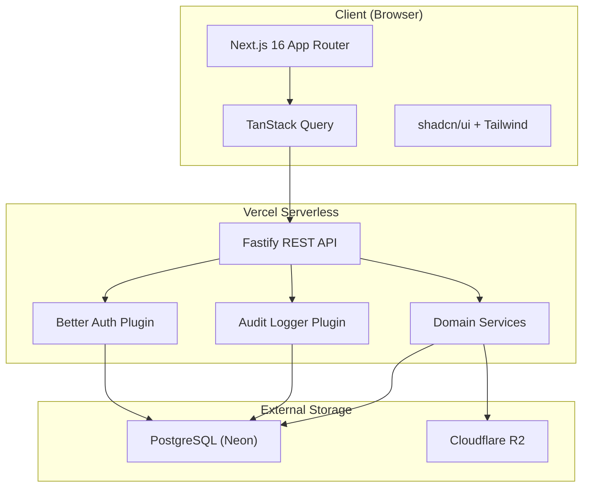
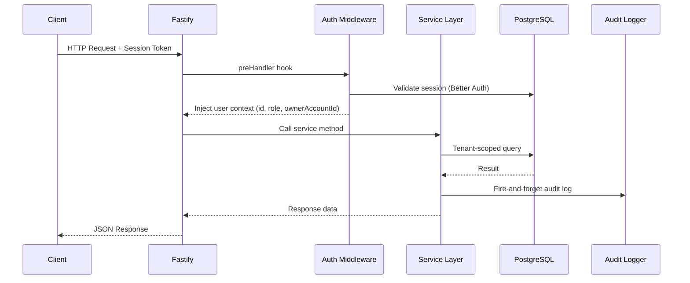
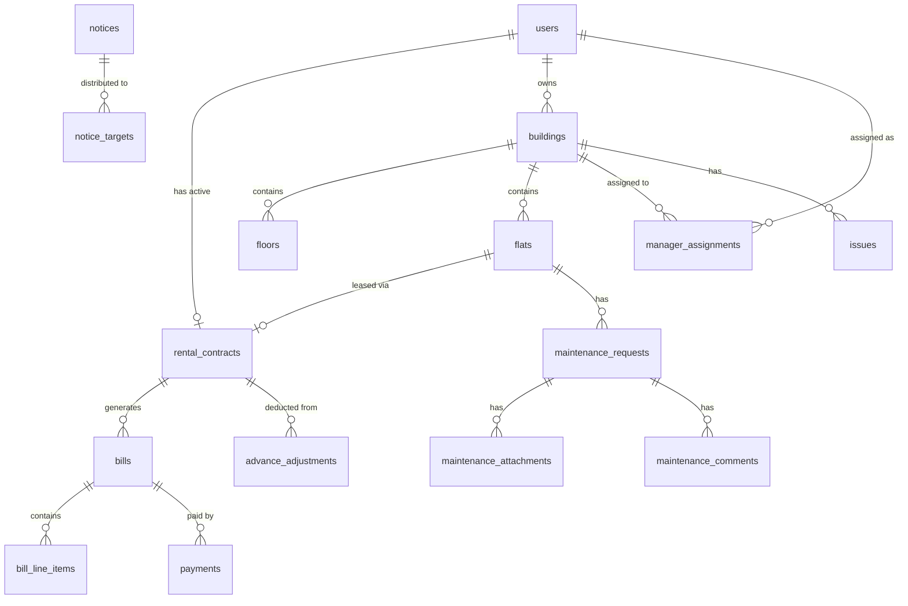
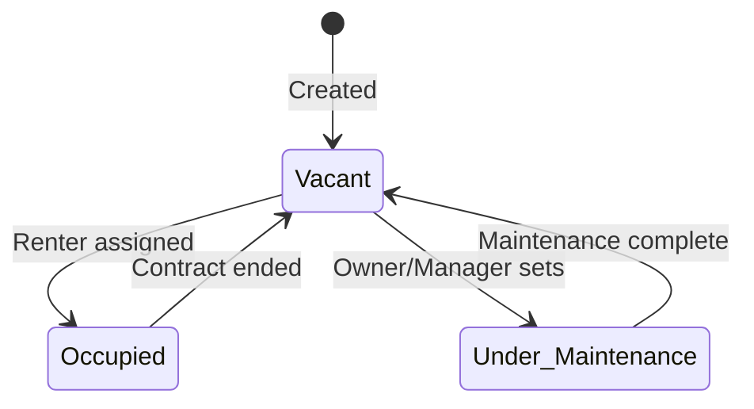
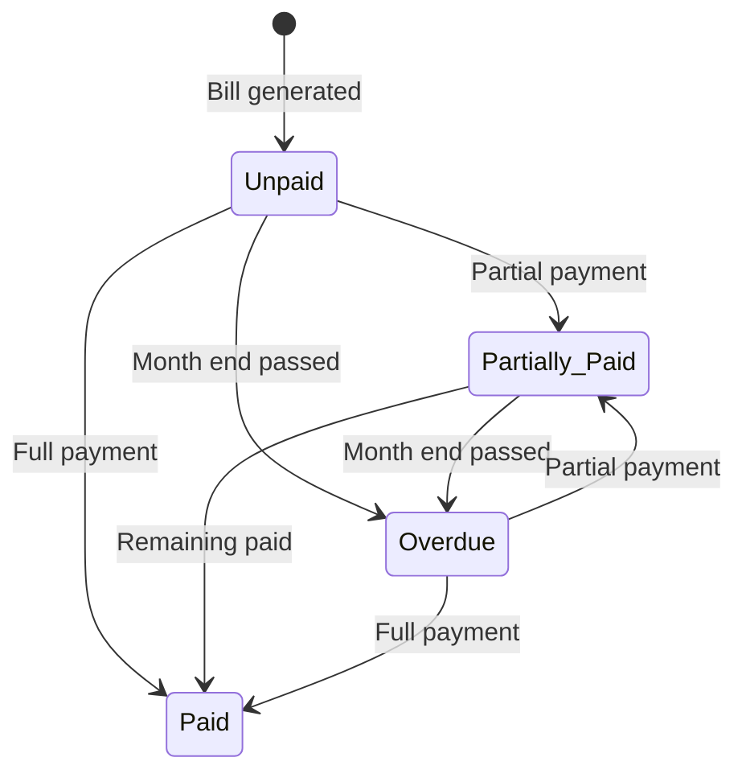
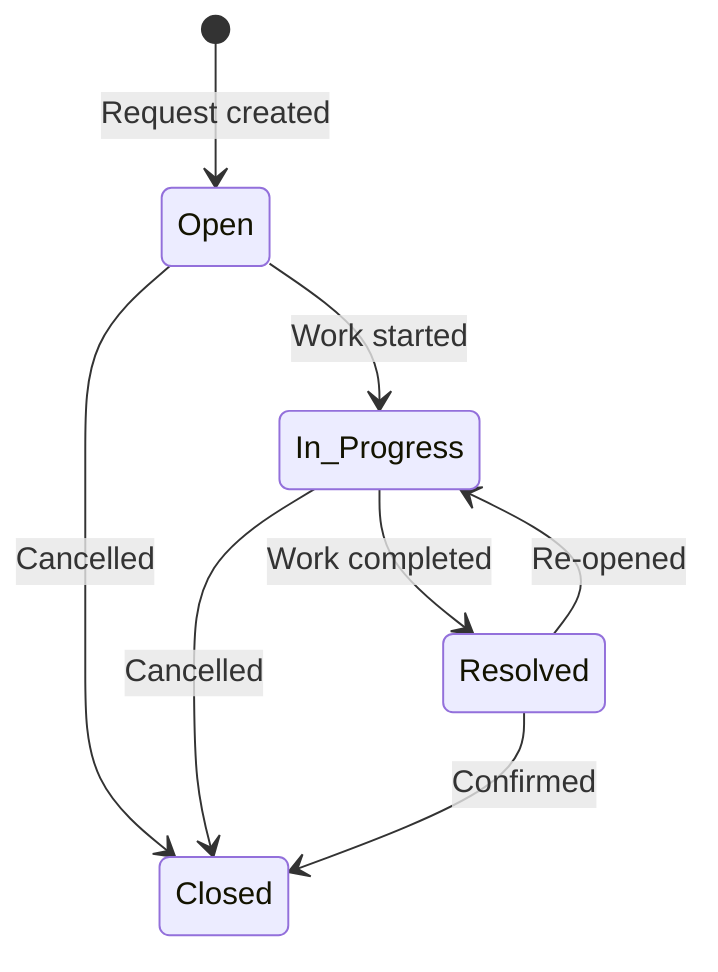
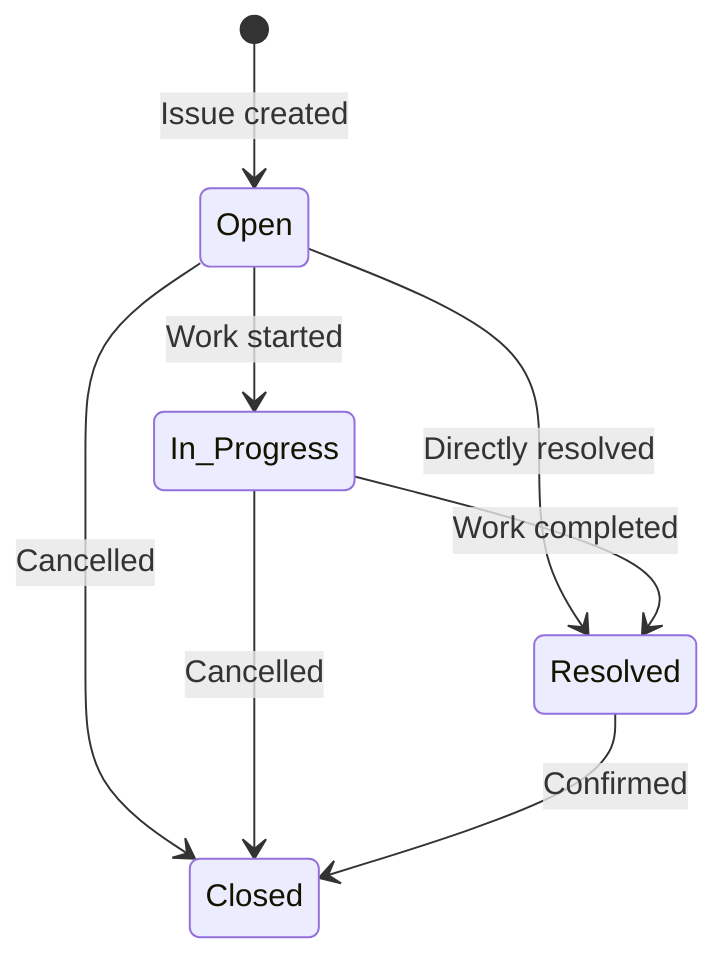

# Design Document: AmarSpace Full Implementation

## Overview

AmarSpace is a multi-tenant apartment management SaaS platform built as a Turborepo monorepo with a Next.js 16 frontend (`apps/web`), a Fastify REST API backend (`apps/api`), and a shared database package (`packages/db`). The system serves Bangladeshi property owners, managers, and renters with a Bangla-first, mobile-first, elderly-friendly interface.

The architecture follows a layered approach:
- **Presentation Layer**: Next.js App Router with TanStack Query for server state, shadcn/ui components, Tailwind CSS responsive utilities
- **API Layer**: Fastify with Zod schema validation (fastify-type-provider-zod), plugin-based architecture, stateless REST endpoints deployed on Vercel serverless
- **Domain Layer**: Service modules (Billing, Payment, Deposit, Maintenance, Notice) encapsulating business logic
- **Data Layer**: PostgreSQL via Drizzle ORM with tenant-scoped queries, Cloudflare R2 for file storage
- **Auth Layer**: Better Auth with email/password, session management, and role-based access control

### Key Design Decisions

1. **Tenant isolation via `ownerAccountId`**: Every tenant-scoped table includes a non-nullable `ownerAccountId` column. All queries filter by this column at the service layer.
2. **Role enforcement at middleware level**: A Fastify preHandler hook resolves the user's role and injects it into the request context. Route handlers declare required roles declaratively.
3. **Audit logging is fire-and-forget**: The existing `AuditLogger` writes asynchronously with retry, ensuring primary request latency is unaffected.
4. **Stateless API for serverless**: No in-memory state between requests. Session validation happens per-request via Better Auth.
5. **Drizzle ORM for type-safe queries**: Schema-first approach with generated migrations. Relations defined in schema for query builder support.


## Architecture

### System Architecture Diagram



### Request Flow



### Monorepo Structure

```
amar-space/
├── apps/
│   ├── web/              # Next.js 16 frontend
│   │   ├── app/          # App Router pages
│   │   ├── components/   # UI components
│   │   ├── lib/          # Client utilities, API client, i18n
│   │   └── hooks/        # Custom React hooks
│   └── api/              # Fastify backend
│       ├── src/
│       │   ├── plugins/  # Fastify plugins (auth, audit, env, r2)
│       │   ├── middleware/ # Auth guard, role check, tenant scope
│       │   ├── routes/   # Route handlers by domain
│       │   ├── services/ # Business logic services
│       │   └── lib/      # Shared utilities
│       └── tests/
│           ├── unit/
│           ├── properties/
│           └── integration/
├── packages/
│   ├── db/               # Drizzle schema, migrations, client
│   │   ├── src/schema/   # Table definitions
│   │   └── drizzle/      # Generated migrations
│   ├── typescript-config/ # Shared TS configs
│   └── shared/           # Shared types, validation schemas, constants
└── docker/
```


## Components and Interfaces

### Backend Services

Each domain service is a class instantiated with a database client and injected into Fastify via plugins. Services enforce tenant isolation and business rules.

```typescript
// Service interface pattern
interface ServiceContext {
  db: Database
  auditLogger: AuditLogger
}

interface RequestContext {
  userId: string
  role: 'owner' | 'manager' | 'renter'
  ownerAccountId: string
  assignedBuildingIds?: string[] // For managers
  assignedFlatId?: string       // For renters
  ipAddress: string
  userAgent: string
}
```

#### BuildingService
- `createBuilding(ctx, data)` — Creates building, validates name uniqueness per owner
- `updateBuilding(ctx, buildingId, data)` — Updates building properties
- `listBuildings(ctx, pagination)` — Lists buildings with tenant scope
- `getBuilding(ctx, buildingId)` — Gets single building

#### FlatService
- `createFlat(ctx, data)` — Creates flat within building, validates uniqueness
- `updateFlat(ctx, flatId, data)` — Updates flat properties/status
- `deleteFlat(ctx, flatId)` — Deletes flat (only if Vacant)
- `listFlats(ctx, buildingId, filters, pagination)` — Lists flats with status filter
- `transitionStatus(ctx, flatId, newStatus)` — Validates state machine transitions

#### RenterRegistrationService
- `registerRenter(ctx, data)` — Full renter onboarding: validates, creates user, contract, updates flat
- `getRenter(ctx, renterId)` — Gets renter details
- `listRenters(ctx, filters, pagination)` — Lists renters with building/flat filter

#### BillingService
- `generateBills(ctx, month)` — Generates bills for all occupied flats in a month
- `addUtilityCharge(ctx, billId, charge)` — Adds line item to bill
- `getBill(ctx, billId)` — Gets bill with line items
- `listBills(ctx, filters, pagination)` — Lists bills with multi-field filter
- `updateOverdueBills()` — Cron/scheduled: marks unpaid bills as overdue

#### PaymentService
- `recordPayment(ctx, data)` — Records payment, updates bill status
- `listPayments(ctx, filters, pagination)` — Lists payment history
- `getPaymentReceipt(ctx, paymentId)` — Gets payment receipt details

#### DepositService
- `getDeposit(ctx, contractId)` — Gets deposit balance and history
- `applyAdjustment(ctx, data)` — Applies adjustment, updates balance, optionally pays bill
- `listAdjustments(ctx, contractId, pagination)` — Lists adjustments for contract

#### MaintenanceService
- `createRequest(ctx, data)` — Creates maintenance request with file attachments
- `updateRequestStatus(ctx, requestId, status)` — Validates state transitions
- `addComment(ctx, requestId, comment)` — Adds comment to request
- `listRequests(ctx, filters, pagination)` — Lists with building/flat/status/priority filter

#### IssueService
- `createIssue(ctx, data)` — Creates building-level issue
- `assignIssue(ctx, issueId, assigneeId)` — Assigns to manager/contractor
- `updateIssueStatus(ctx, issueId, status, notes?)` — Validates transitions, requires notes for Resolved
- `listIssues(ctx, filters, pagination)` — Lists with multi-field filter

#### NoticeService
- `createNotice(ctx, data)` — Creates notice with target audience validation
- `updateNotice(ctx, noticeId, data)` — Updates notice (author/owner check)
- `deleteNotice(ctx, noticeId)` — Deletes notice (author/owner check)
- `togglePin(ctx, noticeId)` — Pins/unpins notice (max 5 per scope)
- `listNotices(ctx, filters, pagination)` — Lists notices visible to user's role

#### FileUploadService
- `uploadFiles(ctx, entityType, entityId, files)` — Uploads to R2, returns references
- `getPresignedUrl(ctx, fileKey)` — Generates 1-hour pre-signed URL
- `deleteFile(ctx, fileKey)` — Deletes file from R2


### Frontend Components

#### Layout Components
- `RootLayout` — Global providers (TanStack Query, i18n, theme)
- `AuthLayout` — Login/register pages without navigation
- `DashboardLayout` — Authenticated pages with navigation (bottom tab mobile, sidebar desktop)
- `BottomTabBar` — Mobile navigation (< 768px)
- `Sidebar` — Desktop navigation (≥ 768px)

#### Page Components (App Router)
- `/` — Redirect to dashboard
- `/login` — Login form
- `/register` — Registration form
- `/dashboard` — Role-specific dashboard
- `/buildings` — Building list and management
- `/buildings/[id]` — Building detail with flats
- `/buildings/[id]/flats` — Flat list for building
- `/flats/[id]` — Flat detail
- `/renters` — Renter list
- `/renters/new` — Renter registration form
- `/renters/[id]` — Renter detail
- `/bills` — Bill list with filters
- `/bills/[id]` — Bill detail with payments
- `/payments` — Payment history
- `/maintenance` — Maintenance request list
- `/maintenance/new` — New maintenance request
- `/maintenance/[id]` — Request detail
- `/issues` — Building issues list
- `/issues/new` — New issue form
- `/issues/[id]` — Issue detail
- `/notices` — Notice list
- `/notices/new` — New notice form
- `/audit` — Audit log viewer (Owner only)
- `/settings` — User settings, language toggle

#### Shared UI Components
- `DataTable` — Paginated table with filters (uses shadcn/ui Table)
- `FormField` — Label-above-input pattern with validation errors
- `ConfirmDialog` — Destructive action confirmation (44x44px buttons)
- `StatusBadge` — Color-coded status indicators
- `CurrencyDisplay` — BDT formatting (৳ with Bangladeshi numbering)
- `DateDisplay` — DD/MM/YYYY Bangla locale formatting
- `FileUpload` — Drag-and-drop with preview, 5MB limit
- `LoadingSkeleton` — Content placeholder during data fetch
- `ErrorFeedback` — Top-of-viewport error/success messages (48px min height, 5s display)
- `LanguageToggle` — Bangla/English switch

### Middleware Stack

```typescript
// Fastify preHandler chain for protected routes
const authGuard = async (request, reply) => {
  // 1. Extract session token from cookie/header
  // 2. Validate via Better Auth
  // 3. Inject user context into request
}

const roleGuard = (allowedRoles: Role[]) => async (request, reply) => {
  // Check request.user.role against allowedRoles
  // Return 403 if not permitted
}

const tenantScope = async (request, reply) => {
  // Inject ownerAccountId filter into request context
  // For managers: resolve assigned building IDs
  // For renters: resolve assigned flat ID
}
```

### API Route Structure

```
/api/health          GET     — Health check
/api/auth/*          ALL     — Better Auth delegation
/api/buildings       GET     — List buildings
/api/buildings       POST    — Create building
/api/buildings/:id   GET     — Get building
/api/buildings/:id   PUT     — Update building
/api/flats           GET     — List flats (query: buildingId, status)
/api/flats           POST    — Create flat
/api/flats/:id       GET     — Get flat
/api/flats/:id       PUT     — Update flat
/api/flats/:id       DELETE  — Delete flat
/api/renters         GET     — List renters
/api/renters         POST    — Register renter
/api/renters/:id     GET     — Get renter
/api/bills           GET     — List bills (query: building, flat, month, status)
/api/bills/generate  POST    — Generate monthly bills
/api/bills/:id       GET     — Get bill detail
/api/bills/:id/charges POST  — Add utility charge
/api/payments        GET     — List payments
/api/payments        POST    — Record payment
/api/payments/:id    GET     — Get payment receipt
/api/deposits/:contractId       GET   — Get deposit balance
/api/deposits/:contractId/adjust POST — Apply adjustment
/api/deposits/:contractId/history GET — List adjustments
/api/maintenance     GET     — List maintenance requests
/api/maintenance     POST    — Create maintenance request
/api/maintenance/:id GET     — Get request detail
/api/maintenance/:id/status PUT — Update status
/api/maintenance/:id/comments POST — Add comment
/api/issues          GET     — List issues
/api/issues          POST    — Create issue
/api/issues/:id      GET     — Get issue detail
/api/issues/:id/status PUT   — Update status
/api/issues/:id/assign PUT   — Assign issue
/api/notices         GET     — List notices
/api/notices         POST    — Create notice
/api/notices/:id     GET     — Get notice
/api/notices/:id     PUT     — Update notice
/api/notices/:id     DELETE  — Delete notice
/api/notices/:id/pin PUT     — Toggle pin
/api/audit           GET     — Query audit logs
/api/files/upload    POST    — Upload files (multipart)
/api/files/:key      GET     — Get pre-signed URL
```


## Data Models

### Entity Relationship Diagram



### Schema Definitions

All tenant-scoped tables include `ownerAccountId` as a non-nullable foreign key to `users.id`.

#### users (extends existing)
```typescript
// Existing fields: id, email, name, hashedPassword, emailVerified, createdAt, updatedAt
// New fields:
role: varchar('role', { length: 20 }).notNull().default('owner'), // 'owner' | 'manager' | 'renter'
ownerAccountId: uuid('owner_account_id').references(() => users.id), // null for owners (they ARE the owner)
phone: varchar('phone', { length: 20 }),
languagePreference: varchar('language_preference', { length: 5 }).default('bn'),
```

#### buildings
```typescript
buildings = pgTable('buildings', {
  id: uuid('id').primaryKey().defaultRandom(),
  ownerAccountId: uuid('owner_account_id').notNull().references(() => users.id),
  name: varchar('name', { length: 200 }).notNull(),
  address: varchar('address', { length: 500 }).notNull(),
  totalFloors: integer('total_floors'),
  createdAt: timestamp('created_at', { withTimezone: true }).notNull().defaultNow(),
  updatedAt: timestamp('updated_at', { withTimezone: true }).notNull().defaultNow(),
})
// Unique constraint: (ownerAccountId, name)
```

#### flats
```typescript
flats = pgTable('flats', {
  id: uuid('id').primaryKey().defaultRandom(),
  ownerAccountId: uuid('owner_account_id').notNull().references(() => users.id),
  buildingId: uuid('building_id').notNull().references(() => buildings.id),
  flatNumber: varchar('flat_number', { length: 20 }).notNull(),
  floor: integer('floor').notNull(),
  status: varchar('status', { length: 20 }).notNull().default('vacant'),
    // 'vacant' | 'occupied' | 'under_maintenance'
  createdAt: timestamp('created_at', { withTimezone: true }).notNull().defaultNow(),
  updatedAt: timestamp('updated_at', { withTimezone: true }).notNull().defaultNow(),
})
// Unique constraint: (buildingId, flatNumber)
```

#### manager_assignments
```typescript
managerAssignments = pgTable('manager_assignments', {
  id: uuid('id').primaryKey().defaultRandom(),
  ownerAccountId: uuid('owner_account_id').notNull().references(() => users.id),
  managerId: uuid('manager_id').notNull().references(() => users.id),
  buildingId: uuid('building_id').notNull().references(() => buildings.id),
  assignedAt: timestamp('assigned_at', { withTimezone: true }).notNull().defaultNow(),
})
// Unique constraint: (managerId, buildingId)
```


#### renters
```typescript
renters = pgTable('renters', {
  id: uuid('id').primaryKey().defaultRandom(),
  ownerAccountId: uuid('owner_account_id').notNull().references(() => users.id),
  userId: uuid('user_id').notNull().references(() => users.id),
  fullName: varchar('full_name', { length: 255 }).notNull(),
  phone: varchar('phone', { length: 20 }).notNull(),
  nidNumber: varchar('nid_number', { length: 17 }).notNull(),
  nidPhotoUrl: varchar('nid_photo_url', { length: 500 }),
  dateOfBirth: date('date_of_birth'),
  occupation: varchar('occupation', { length: 200 }).notNull(),
  bloodGroup: varchar('blood_group', { length: 5 }).notNull(),
    // 'A+' | 'A-' | 'B+' | 'B-' | 'AB+' | 'AB-' | 'O+' | 'O-'
  totalFamilyMembers: integer('total_family_members').notNull(),
  familyMemberNames: jsonb('family_member_names'), // string[] max 20 entries
  emergencyContactName: varchar('emergency_contact_name', { length: 200 }).notNull(),
  emergencyContactNumber: varchar('emergency_contact_number', { length: 20 }).notNull(),
  emergencyContactRelationship: varchar('emergency_contact_relationship', { length: 100 }).notNull(),
  digitalSignatureUrl: varchar('digital_signature_url', { length: 500 }),
  createdAt: timestamp('created_at', { withTimezone: true }).notNull().defaultNow(),
  updatedAt: timestamp('updated_at', { withTimezone: true }).notNull().defaultNow(),
})
```

#### rental_contracts
```typescript
rentalContracts = pgTable('rental_contracts', {
  id: uuid('id').primaryKey().defaultRandom(),
  ownerAccountId: uuid('owner_account_id').notNull().references(() => users.id),
  renterId: uuid('renter_id').notNull().references(() => renters.id),
  flatId: uuid('flat_id').notNull().references(() => flats.id),
  monthlyRent: numeric('monthly_rent', { precision: 12, scale: 2 }).notNull(),
  startDate: date('start_date').notNull(),
  endDate: date('end_date'),
  securityDepositAmount: numeric('security_deposit_amount', { precision: 12, scale: 2 }).notNull(),
  remainingDepositBalance: numeric('remaining_deposit_balance', { precision: 12, scale: 2 }).notNull(),
  status: varchar('status', { length: 20 }).notNull().default('active'),
    // 'active' | 'terminated' | 'expired'
  createdAt: timestamp('created_at', { withTimezone: true }).notNull().defaultNow(),
  updatedAt: timestamp('updated_at', { withTimezone: true }).notNull().defaultNow(),
})
```

#### bills
```typescript
bills = pgTable('bills', {
  id: uuid('id').primaryKey().defaultRandom(),
  ownerAccountId: uuid('owner_account_id').notNull().references(() => users.id),
  contractId: uuid('contract_id').notNull().references(() => rentalContracts.id),
  flatId: uuid('flat_id').notNull().references(() => flats.id),
  renterId: uuid('renter_id').notNull().references(() => renters.id),
  billingMonth: varchar('billing_month', { length: 7 }).notNull(), // YYYY-MM
  baseRent: numeric('base_rent', { precision: 12, scale: 2 }).notNull(),
  totalAmount: numeric('total_amount', { precision: 12, scale: 2 }).notNull(),
  paidAmount: numeric('paid_amount', { precision: 12, scale: 2 }).notNull().default('0'),
  status: varchar('status', { length: 20 }).notNull().default('unpaid'),
    // 'unpaid' | 'partially_paid' | 'paid' | 'overdue'
  createdAt: timestamp('created_at', { withTimezone: true }).notNull().defaultNow(),
  updatedAt: timestamp('updated_at', { withTimezone: true }).notNull().defaultNow(),
})
// Unique constraint: (flatId, billingMonth)
```

#### bill_line_items
```typescript
billLineItems = pgTable('bill_line_items', {
  id: uuid('id').primaryKey().defaultRandom(),
  billId: uuid('bill_id').notNull().references(() => bills.id, { onDelete: 'cascade' }),
  description: varchar('description', { length: 200 }).notNull(),
  amount: numeric('amount', { precision: 10, scale: 2 }).notNull(),
  createdAt: timestamp('created_at', { withTimezone: true }).notNull().defaultNow(),
})
```


#### payments
```typescript
payments = pgTable('payments', {
  id: uuid('id').primaryKey().defaultRandom(),
  ownerAccountId: uuid('owner_account_id').notNull().references(() => users.id),
  billId: uuid('bill_id').notNull().references(() => bills.id),
  receiptReference: varchar('receipt_reference', { length: 20 }).notNull().unique(),
  amount: numeric('amount', { precision: 12, scale: 2 }).notNull(),
  paymentDate: date('payment_date').notNull(),
  paymentMethod: varchar('payment_method', { length: 20 }).notNull(),
    // 'cash' | 'bank_transfer' | 'mobile_banking'
  note: varchar('note', { length: 500 }),
  createdAt: timestamp('created_at', { withTimezone: true }).notNull().defaultNow(),
})
```

#### advance_adjustments
```typescript
advanceAdjustments = pgTable('advance_adjustments', {
  id: uuid('id').primaryKey().defaultRandom(),
  ownerAccountId: uuid('owner_account_id').notNull().references(() => users.id),
  contractId: uuid('contract_id').notNull().references(() => rentalContracts.id),
  amount: numeric('amount', { precision: 12, scale: 2 }).notNull(),
  billId: uuid('bill_id').references(() => bills.id), // optional link to bill
  note: varchar('note', { length: 500 }),
  adjustedBy: uuid('adjusted_by').notNull().references(() => users.id),
  createdAt: timestamp('created_at', { withTimezone: true }).notNull().defaultNow(),
})
```

#### maintenance_requests
```typescript
maintenanceRequests = pgTable('maintenance_requests', {
  id: uuid('id').primaryKey().defaultRandom(),
  ownerAccountId: uuid('owner_account_id').notNull().references(() => users.id),
  flatId: uuid('flat_id').notNull().references(() => flats.id),
  renterId: uuid('renter_id').notNull().references(() => renters.id),
  buildingId: uuid('building_id').notNull().references(() => buildings.id),
  title: varchar('title', { length: 200 }).notNull(),
  description: varchar('description', { length: 2000 }).notNull(),
  priority: varchar('priority', { length: 10 }).notNull(),
    // 'low' | 'medium' | 'high' | 'urgent'
  status: varchar('status', { length: 20 }).notNull().default('open'),
    // 'open' | 'in_progress' | 'resolved' | 'closed'
  createdAt: timestamp('created_at', { withTimezone: true }).notNull().defaultNow(),
  updatedAt: timestamp('updated_at', { withTimezone: true }).notNull().defaultNow(),
})
```

#### maintenance_attachments
```typescript
maintenanceAttachments = pgTable('maintenance_attachments', {
  id: uuid('id').primaryKey().defaultRandom(),
  requestId: uuid('request_id').notNull().references(() => maintenanceRequests.id, { onDelete: 'cascade' }),
  fileUrl: varchar('file_url', { length: 500 }).notNull(),
  fileName: varchar('file_name', { length: 255 }).notNull(),
  fileSize: integer('file_size').notNull(),
  mimeType: varchar('mime_type', { length: 50 }).notNull(),
  createdAt: timestamp('created_at', { withTimezone: true }).notNull().defaultNow(),
})
```

#### maintenance_comments
```typescript
maintenanceComments = pgTable('maintenance_comments', {
  id: uuid('id').primaryKey().defaultRandom(),
  requestId: uuid('request_id').notNull().references(() => maintenanceRequests.id, { onDelete: 'cascade' }),
  authorId: uuid('author_id').notNull().references(() => users.id),
  content: varchar('content', { length: 2000 }).notNull(),
  createdAt: timestamp('created_at', { withTimezone: true }).notNull().defaultNow(),
})
```

#### issues
```typescript
issues = pgTable('issues', {
  id: uuid('id').primaryKey().defaultRandom(),
  ownerAccountId: uuid('owner_account_id').notNull().references(() => users.id),
  buildingId: uuid('building_id').notNull().references(() => buildings.id),
  title: varchar('title', { length: 200 }).notNull(),
  description: varchar('description', { length: 2000 }).notNull(),
  category: varchar('category', { length: 20 }).notNull(),
    // 'plumbing' | 'electrical' | 'structural' | 'cleaning' | 'security' | 'other'
  priority: varchar('priority', { length: 10 }).notNull(),
    // 'low' | 'medium' | 'high' | 'urgent'
  status: varchar('status', { length: 20 }).notNull().default('open'),
    // 'open' | 'in_progress' | 'resolved' | 'closed'
  assigneeId: uuid('assignee_id').references(() => users.id),
  resolutionNotes: varchar('resolution_notes', { length: 2000 }),
  resolvedAt: timestamp('resolved_at', { withTimezone: true }),
  createdAt: timestamp('created_at', { withTimezone: true }).notNull().defaultNow(),
  updatedAt: timestamp('updated_at', { withTimezone: true }).notNull().defaultNow(),
})
```


#### notices
```typescript
notices = pgTable('notices', {
  id: uuid('id').primaryKey().defaultRandom(),
  ownerAccountId: uuid('owner_account_id').notNull().references(() => users.id),
  authorId: uuid('author_id').notNull().references(() => users.id),
  title: varchar('title', { length: 200 }).notNull(),
  body: varchar('body', { length: 5000 }).notNull(),
  targetAudience: varchar('target_audience', { length: 20 }).notNull(),
    // 'all_renters' | 'specific_building' | 'specific_flat' | 'managers_only'
  targetBuildingId: uuid('target_building_id').references(() => buildings.id),
  targetFlatId: uuid('target_flat_id').references(() => flats.id),
  isPinned: boolean('is_pinned').notNull().default(false),
  pinnedAt: timestamp('pinned_at', { withTimezone: true }),
  createdAt: timestamp('created_at', { withTimezone: true }).notNull().defaultNow(),
  updatedAt: timestamp('updated_at', { withTimezone: true }).notNull().defaultNow(),
})
```

#### file_references
```typescript
fileReferences = pgTable('file_references', {
  id: uuid('id').primaryKey().defaultRandom(),
  ownerAccountId: uuid('owner_account_id').notNull().references(() => users.id),
  entityType: varchar('entity_type', { length: 50 }).notNull(), // 'renter_nid' | 'maintenance' | 'signature'
  entityId: uuid('entity_id').notNull(),
  storageKey: varchar('storage_key', { length: 500 }).notNull(),
  fileName: varchar('file_name', { length: 255 }).notNull(),
  fileSize: integer('file_size').notNull(),
  mimeType: varchar('mime_type', { length: 50 }).notNull(),
  createdAt: timestamp('created_at', { withTimezone: true }).notNull().defaultNow(),
})
```

### State Machines

#### Flat Status Transitions


#### Bill Status Transitions


#### Maintenance Request Status Transitions


#### Issue Status Transitions



## Correctness Properties

*A property is a characteristic or behavior that should hold true across all valid executions of a system — essentially, a formal statement about what the system should do. Properties serve as the bridge between human-readable specifications and machine-verifiable correctness guarantees.*

### Property 1: Registration produces valid account with Owner role

*For any* valid email (≤254 chars, standard format) and valid password (8-128 chars with uppercase, lowercase, and digit), registering a new user SHALL produce an account with the Owner role, a hashed password that differs from the plaintext, and a lowercase-normalized email.

**Validates: Requirements 1.1, 1.2, 1.5**

### Property 2: Email and password validation correctness

*For any* string input, the email validator SHALL accept only strings conforming to standard email format with maximum 254 characters, and the password validator SHALL accept only strings between 8-128 characters containing at least one uppercase letter, one lowercase letter, and one digit. All other inputs SHALL be rejected with appropriate field-level errors.

**Validates: Requirements 1.5, 1.6**

### Property 3: Duplicate email rejection

*For any* email address already associated with an existing account, a subsequent registration attempt with that email SHALL be rejected regardless of password or other field values.

**Validates: Requirements 1.3**

### Property 4: Role-based access control enforcement

*For any* user with a given role and any resource/action combination, the system SHALL grant access if and only if the role's permission set includes that resource/action. Specifically: Owner has full access, Manager has access only to assigned buildings' operational features, and Renter has access only to their own flat's data.

**Validates: Requirements 3.1, 3.2, 3.3, 3.4, 3.6, 3.9**

### Property 5: Renter registration field validation

*For any* input to the renter registration form: NID validation SHALL accept only numeric strings of 10-17 digits; blood group validation SHALL accept only one of {A+, A-, B+, B-, AB+, AB-, O+, O-}; total family members SHALL accept only integers 1-50 inclusive; phone number SHALL accept only 11-digit strings starting with "01". All invalid inputs SHALL be rejected with field-level errors.

**Validates: Requirements 4.3, 4.4, 4.5, 4.6, 4.9**


### Property 6: Flat assignment requires Vacant status

*For any* flat with a status other than Vacant, attempting to assign a renter to that flat SHALL be rejected. Only flats with status Vacant SHALL accept renter assignment.

**Validates: Requirements 4.13, 6.6**

### Property 7: Building name uniqueness per owner

*For any* owner account, creating a building with a name that already exists within that owner's account SHALL be rejected. Building names across different owners are independent.

**Validates: Requirements 5.9**

### Property 8: Flat number uniqueness within building

*For any* building, creating a flat with a flat number that already exists within that building SHALL be rejected. The same flat number in different buildings is allowed.

**Validates: Requirements 6.12**

### Property 9: Flat status transition validity

*For any* flat in any status, the only valid transitions are: Vacant → Occupied (renter assigned), Occupied → Vacant (contract ended), Vacant → Under_Maintenance, Under_Maintenance → Vacant. All other transitions SHALL be rejected. Occupied flats cannot be deleted.

**Validates: Requirements 6.13, 6.14**

### Property 10: Bill total equals base rent plus line items

*For any* bill with any number of utility line items (0 to 20), the total bill amount SHALL equal the base rent amount plus the sum of all line item amounts. This invariant holds after any line item addition.

**Validates: Requirements 7.3**

### Property 11: No duplicate bills per flat per month

*For any* flat and billing month combination, the system SHALL contain at most one bill. Attempting to generate a second bill for the same flat and month SHALL be rejected.

**Validates: Requirements 7.10**

### Property 12: Payment correctly updates bill status

*For any* bill with a remaining balance and any payment amount: if payment equals remaining balance, bill status SHALL become Paid; if payment is less than remaining balance, bill status SHALL become Partially_Paid; if payment exceeds remaining balance, the payment SHALL be rejected. The paid amount on the bill SHALL equal the sum of all recorded payments.

**Validates: Requirements 8.2, 8.3, 8.4, 8.5**

### Property 13: Deposit adjustment maintains balance invariant

*For any* rental contract with a remaining deposit balance, applying an adjustment of amount A where A ≤ remaining balance SHALL reduce the remaining balance by exactly A. Adjustments where A > remaining balance SHALL be rejected. The remaining balance SHALL always equal the initial deposit minus the sum of all adjustment amounts.

**Validates: Requirements 9.2, 9.3, 9.4**


### Property 14: Deposit adjustment linked to bill acts as payment

*For any* advance adjustment linked to a bill, the adjustment amount SHALL be applied as a payment against that bill, updating the bill's paid amount and status according to the same rules as direct payments (Property 12). The adjustment SHALL be rejected if the bill is already Paid or if the adjustment exceeds the bill's outstanding balance.

**Validates: Requirements 9.5, 9.6**

### Property 15: Maintenance request status transition validity

*For any* maintenance request in any status, only the following transitions are valid: Open → In_Progress, Open → Closed, In_Progress → Resolved, In_Progress → Closed, Resolved → Closed, Resolved → In_Progress. All other transitions SHALL be rejected.

**Validates: Requirements 10.5, 10.12**

### Property 16: Issue status transition validity

*For any* issue in any status, only the following transitions are valid: Open → In_Progress, Open → Resolved, Open → Closed, In_Progress → Resolved, In_Progress → Closed, Resolved → Closed. Closed is a terminal state with no outgoing transitions. Resolved requires resolution notes.

**Validates: Requirements 11.4, 11.8, 11.9**

### Property 17: Tenant data isolation

*For any* data query executed by any authenticated user, the results SHALL never include records where the ownerAccountId differs from the querying user's owner account. Attempting to access a specific resource belonging to a different owner SHALL return HTTP 404.

**Validates: Requirements 17.2, 17.3, 17.6**

### Property 18: File upload validation

*For any* file upload, the system SHALL accept only files with MIME types in {image/jpeg, image/png, image/webp, application/pdf} and size ≤ 5MB. Files failing either constraint SHALL be rejected with a structured error identifying the file name, rejection reason, and allowed constraints.

**Validates: Requirements 18.3, 18.9**

### Property 19: BDT currency formatting

*For any* numeric amount, the currency formatter SHALL produce a string with the ৳ symbol followed by the amount with 2 decimal places and comma separators following the Bangladeshi numbering system (last 3 digits grouped, then groups of 2).

**Validates: Requirements 15.3**

### Property 20: API error response structure

*For any* failed API request, the error response SHALL contain a `requestId` field in UUID v4 format. Validation errors (400) SHALL include an `errors` array with field path, rule, and message. Permission errors (403) SHALL not reveal required permissions. Server errors (500) SHALL not expose internal details.

**Validates: Requirements 19.2, 19.3, 19.4, 19.5, 19.6**


## Error Handling

### Error Response Format

All API errors follow a consistent structure:

```typescript
interface ApiErrorResponse {
  requestId: string       // UUID v4, included in every response
  statusCode: number
  error: string           // HTTP status text
  message: string         // Human-readable message (Bangla for 400 errors)
  errors?: FieldError[]   // Only for validation errors (max 50 entries)
}

interface FieldError {
  field: string    // JSON path to the invalid field (e.g., "phone", "address.city")
  rule: string     // Validation rule that failed (e.g., "minLength", "pattern")
  message: string  // Human-readable error in active language
}
```

### Error Categories

| Status | Scenario | Behavior |
|--------|----------|----------|
| 400 | Validation failure | Return field-level errors array |
| 401 | Invalid/expired session | Generic "session invalid" message |
| 403 | Insufficient permissions | Generic "insufficient permissions" without revealing required role |
| 404 | Resource not found OR cross-tenant access | Same response for both (prevents enumeration) |
| 409 | Duplicate resource (building name, flat number, bill) | Identify the conflicting field |
| 413 | Request body > 1MB | Reject before processing |
| 429 | Rate limit exceeded | Generic "too many attempts" |
| 500 | Unexpected server error | Generic message, no stack traces or internal details |
| 503 | External service unavailable (R2) | Include Retry-After header (30s) |

### Error Handling Strategy

1. **Validation errors**: Caught at the Fastify schema validation layer (Zod). The existing error handler in `app.ts` already transforms these into structured responses.
2. **Business logic errors**: Services throw typed error classes (`ConflictError`, `ForbiddenError`, `NotFoundError`) that the error handler maps to appropriate HTTP status codes.
3. **External service failures**: R2 upload failures return 503 with Retry-After. Database connection failures trigger 500 with generic message.
4. **Audit log failures**: Never affect the primary response. Failures are queued for retry (existing `AuditLogger` pattern).

### Custom Error Classes

```typescript
class AppError extends Error {
  constructor(
    public statusCode: number,
    public code: string,
    message: string,
    public details?: FieldError[]
  ) {
    super(message)
  }
}

class ValidationError extends AppError {
  constructor(errors: FieldError[]) {
    super(400, 'VALIDATION_ERROR', 'Validation failed', errors)
  }
}

class NotFoundError extends AppError {
  constructor(entityType: string, entityId: string) {
    super(404, 'NOT_FOUND', `${entityType} not found`)
  }
}

class ForbiddenError extends AppError {
  constructor() {
    super(403, 'FORBIDDEN', 'Insufficient permissions')
  }
}

class ConflictError extends AppError {
  constructor(message: string) {
    super(409, 'CONFLICT', message)
  }
}

class RateLimitError extends AppError {
  constructor() {
    super(429, 'RATE_LIMITED', 'Too many attempts, please try again later')
  }
}
```


## Testing Strategy

### Testing Framework

- **Test runner**: Vitest (already configured in `apps/api/vitest.config.ts` and `packages/db/vitest.config.ts`)
- **Property-based testing**: fast-check 4.8.0 (already in devDependencies)
- **Assertion library**: Vitest built-in assertions

### Test Organization

```
apps/api/tests/
├── unit/              # Unit tests for services and utilities
│   ├── billing.test.ts
│   ├── payment.test.ts
│   ├── deposit.test.ts
│   ├── validation.test.ts
│   └── ...
├── properties/        # Property-based tests
│   ├── billing.property.test.ts
│   ├── payment.property.test.ts
│   ├── deposit.property.test.ts
│   ├── validation.property.test.ts
│   ├── state-machines.property.test.ts
│   ├── tenant-isolation.property.test.ts
│   └── ...
└── integration/       # Integration tests with database
    ├── auth.integration.test.ts
    ├── buildings.integration.test.ts
    └── ...

packages/db/tests/
├── properties/        # Schema-level property tests
│   └── formatting.property.test.ts
└── ...
```

### Property-Based Testing Configuration

Each property test runs a minimum of **100 iterations** using fast-check. Tests are tagged with the property they validate:

```typescript
// Example property test structure
import { fc, test } from '@fast-check/vitest'

// Feature: amarspace-full-implementation, Property 10: Bill total equals base rent plus line items
test.prop([fc.float({ min: 100, max: 999999 }), fc.array(fc.float({ min: 0.01, max: 999999.99 }), { maxLength: 20 })],
  { numRuns: 100 }
)('bill total invariant', (baseRent, lineItemAmounts) => {
  // ... test implementation
})
```

### Dual Testing Approach

| Test Type | Purpose | Coverage |
|-----------|---------|----------|
| Property tests | Verify universal invariants across random inputs | Properties 1-20 |
| Unit tests | Verify specific examples, edge cases, error messages | Specific scenarios, boundary conditions |
| Integration tests | Verify database operations, auth flows, file uploads | End-to-end flows with real DB |

### Property Test Mapping

| Property | Test File | Key Generators |
|----------|-----------|----------------|
| 1: Registration | `validation.property.test.ts` | Email strings, password strings |
| 2: Email/password validation | `validation.property.test.ts` | Arbitrary strings |
| 3: Duplicate email | `auth.property.test.ts` | Valid email addresses |
| 4: RBAC enforcement | `rbac.property.test.ts` | Role × resource × action tuples |
| 5: Renter field validation | `validation.property.test.ts` | NID strings, phone strings, integers |
| 6: Flat assignment | `state-machines.property.test.ts` | Flat status values |
| 7: Building name uniqueness | `buildings.property.test.ts` | Building name strings |
| 8: Flat number uniqueness | `flats.property.test.ts` | Flat number strings |
| 9: Flat status transitions | `state-machines.property.test.ts` | Status × target status pairs |
| 10: Bill total invariant | `billing.property.test.ts` | Rent amounts, line item arrays |
| 11: No duplicate bills | `billing.property.test.ts` | Flat IDs, month strings |
| 12: Payment status update | `payment.property.test.ts` | Bill amounts, payment amounts |
| 13: Deposit balance invariant | `deposit.property.test.ts` | Deposit amounts, adjustment sequences |
| 14: Deposit-to-bill adjustment | `deposit.property.test.ts` | Adjustment amounts, bill balances |
| 15: Maintenance transitions | `state-machines.property.test.ts` | Status × target status pairs |
| 16: Issue transitions | `state-machines.property.test.ts` | Status × target status pairs |
| 17: Tenant isolation | `tenant-isolation.property.test.ts` | Multi-tenant data sets |
| 18: File validation | `validation.property.test.ts` | MIME types, file sizes |
| 19: BDT formatting | `formatting.property.test.ts` | Numeric amounts |
| 20: Error response structure | `error-handling.property.test.ts` | Invalid request bodies |

### Unit Test Focus Areas

- Specific error message content (Bangla translations)
- Edge cases: empty arrays, boundary values (exactly 5MB, exactly 50 items)
- Date boundary handling (month-end overdue logic)
- Receipt reference generation uniqueness
- Pre-signed URL expiration logic
- Audit log truncation at 10KB

### Integration Test Focus Areas

- Better Auth session lifecycle (login → use → logout → reject)
- Database constraint enforcement (unique indexes, foreign keys)
- Cloudflare R2 upload/download flow
- Multi-step transactions (renter registration: create user + contract + update flat)
- Pagination correctness with real data volumes

