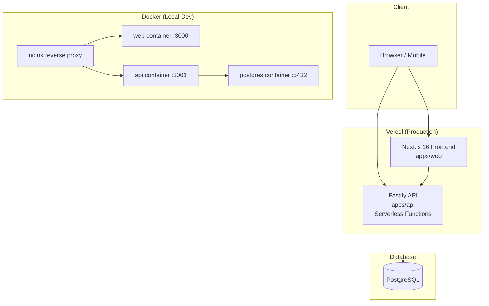
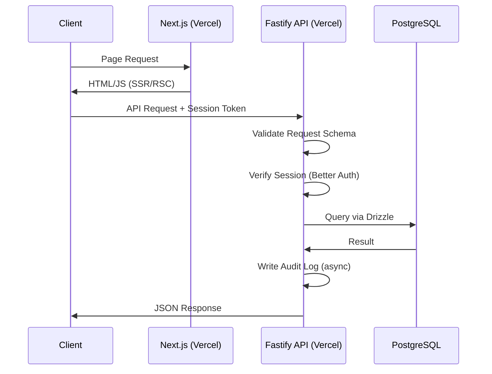
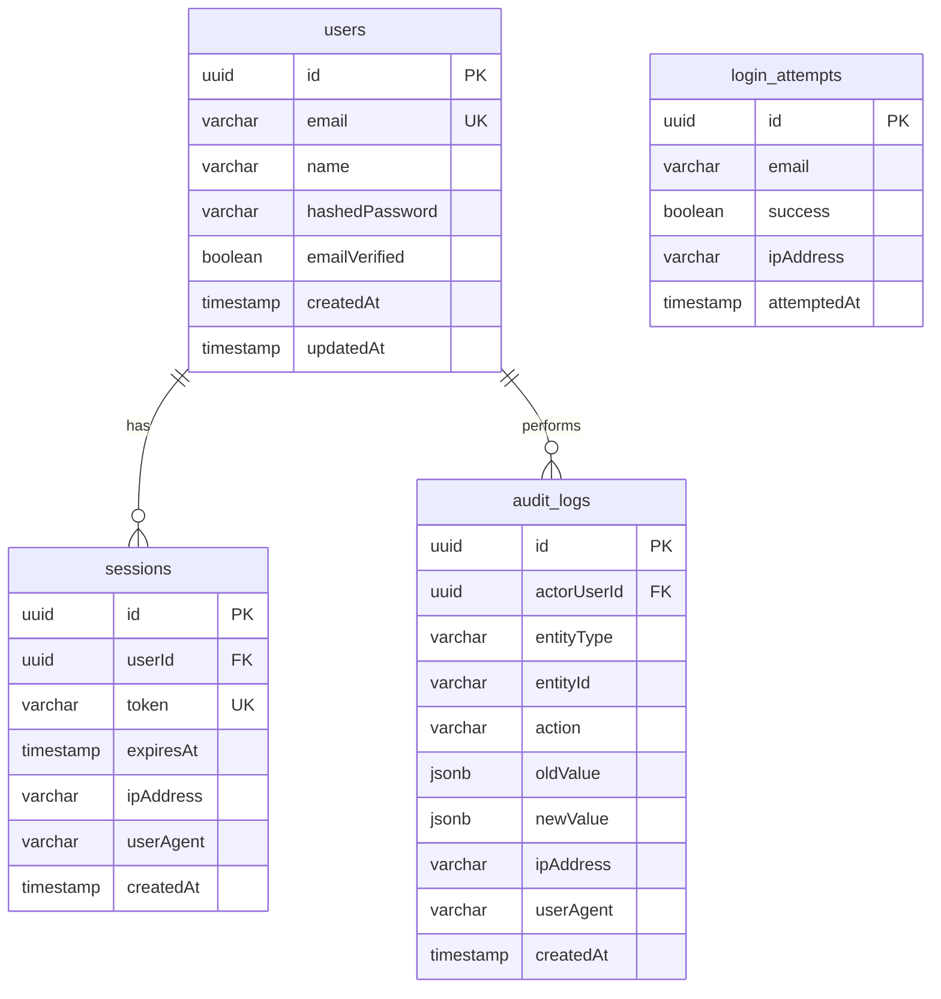

# Design Document: AmarSpace Infrastructure Setup

## Overview

This design defines the foundational infrastructure for AmarSpace — a property management platform built as a Turborepo monorepo. The infrastructure establishes the backend API (Fastify on Vercel serverless), database layer (PostgreSQL + Drizzle ORM), authentication (Better Auth), Docker containerization, audit logging, and shared package architecture.

The system is designed for dual deployment: local development via Docker Compose and production via Vercel serverless. All components are stateless, TypeScript-strict, and organized for future SaaS scalability.

### Key Design Decisions

| Decision | Choice | Rationale |
|----------|--------|-----------|
| Package Manager | Bun | Already configured; fast installs, native workspace support |
| API Framework | Fastify | Lightweight, schema-first validation, serverless-compatible |
| ORM | Drizzle | Type-safe, SQL-like API, lightweight, excellent migration tooling |
| Auth | Better Auth | Modern, TypeScript-first, supports session-based auth with DB storage |
| Containerization | Docker + Compose | Local dev parity, future VPS portability |
| Validation | Zod | Shared between frontend/backend, Fastify integration via fastify-type-provider-zod |
| Connection Pooling | Neon Serverless Driver / pg Pool | Serverless-optimized pooling with configurable limits |

## Architecture

### High-Level System Diagram



### Monorepo Structure

```
amar-space/
├── apps/
│   ├── web/                    # Next.js 16 frontend
│   │   ├── Dockerfile
│   │   ├── package.json
│   │   └── src/
│   ├── api/                    # Fastify backend (NEW)
│   │   ├── Dockerfile
│   │   ├── package.json
│   │   └── src/
│   │       ├── index.ts        # Entry point
│   │       ├── app.ts          # Fastify app factory
│   │       ├── plugins/        # Fastify plugins
│   │       ├── routes/         # Route handlers
│   │       ├── middleware/     # Request middleware
│   │       └── lib/            # Utilities
│   └── docs/                   # Documentation
├── packages/
│   ├── db/                     # Database layer (NEW)
│   │   ├── package.json
│   │   ├── drizzle.config.ts
│   │   ├── src/
│   │   │   ├── index.ts        # Main exports
│   │   │   ├── schema/         # Drizzle schemas
│   │   │   ├── client.ts       # DB client config
│   │   │   └── seed.ts         # Seed scripts
│   │   └── migrations/         # SQL migration files
│   ├── eslint-config/          # Shared ESLint rules
│   ├── typescript-config/      # Shared TS configs
│   └── ui/                     # Shared UI components
├── docker/
│   └── nginx/
│       └── default.conf        # Nginx config
├── docker-compose.yml          # Production compose
├── docker-compose.override.yml # Dev overrides
├── .env.example
├── turbo.json
└── package.json
```

### Request Flow (Production)



## Components and Interfaces

### 1. Backend API (`apps/api`)

The Fastify application is structured as a plugin-based architecture for modularity.

#### App Factory (`src/app.ts`)

```typescript
import Fastify from 'fastify';
import { ZodTypeProvider } from 'fastify-type-provider-zod';

export function buildApp(opts = {}) {
  const app = Fastify(opts).withTypeProvider<ZodTypeProvider>();

  // Register plugins
  app.register(import('./plugins/env'));
  app.register(import('./plugins/db'));
  app.register(import('./plugins/auth'));
  app.register(import('./plugins/audit'));

  // Register routes
  app.register(import('./routes/auth'), { prefix: '/api/auth' });
  app.register(import('./routes/health'), { prefix: '/api/health' });

  return app;
}
```

#### Vercel Entry Point (`src/index.ts`)

```typescript
import { buildApp } from './app';

const app = buildApp({ logger: true });

export default async function handler(req: Request) {
  await app.ready();
  return app.fetch(req);
}
```

#### Error Handler Interface

```typescript
interface ApiError {
  statusCode: number;
  error: string;
  message: string;
  details?: FieldError[];
}

interface FieldError {
  field: string;
  rule: string;
  message: string;
}
```

### 2. Database Package (`packages/db`)

#### Client Configuration (`src/client.ts`)

```typescript
import { drizzle } from 'drizzle-orm/neon-http';
import { neon } from '@neondatabase/serverless';
import * as schema from './schema';

export function createDbClient(databaseUrl: string) {
  const sql = neon(databaseUrl);
  return drizzle(sql, { schema });
}

export type Database = ReturnType<typeof createDbClient>;
```

#### Package Exports (`package.json`)

```json
{
  "name": "@repo/db",
  "exports": {
    ".": "./src/index.ts",
    "./schema": "./src/schema/index.ts",
    "./client": "./src/client.ts",
    "./migrate": "./src/migrate.ts"
  }
}
```

### 3. Authentication Plugin (`apps/api/src/plugins/auth.ts`)

```typescript
import { betterAuth } from 'better-auth';
import { drizzleAdapter } from 'better-auth/adapters/drizzle';
import type { Database } from '@repo/db';

export interface AuthConfig {
  db: Database;
  secret: string;
  baseURL: string;
  sessionMaxAge: number; // 7 days in seconds
  rateLimitMaxAttempts: number; // 5
  rateLimitWindowMs: number; // 15 minutes
}

export function createAuth(config: AuthConfig) {
  return betterAuth({
    database: drizzleAdapter(config.db),
    secret: config.secret,
    baseURL: config.baseURL,
    emailAndPassword: { enabled: true },
    session: {
      expiresIn: config.sessionMaxAge,
      updateAge: 60 * 60 * 24, // refresh daily
    },
    rateLimit: {
      window: config.rateLimitWindowMs,
      max: config.rateLimitMaxAttempts,
    },
  });
}
```

### 4. Audit Logger (`apps/api/src/plugins/audit.ts`)

```typescript
export interface AuditLogEntry {
  actorUserId: string;
  entityType: string;   // max 100 chars
  entityId: string;
  action: string;       // max 100 chars
  oldValue?: unknown;   // JSON, max 10KB
  newValue?: unknown;   // JSON, max 10KB
  ipAddress: string;
  userAgent: string;
}

export interface AuditLogger {
  log(entry: AuditLogEntry): Promise<void>;
  query(params: AuditQueryParams): Promise<PaginatedResult<AuditLog>>;
}

export interface AuditQueryParams {
  page: number;
  limit: number; // max 100
  entityType?: string;
  actorUserId?: string;
  propertyId?: string; // for manager-scoped queries
}
```

### 5. Environment Validation (`apps/api/src/plugins/env.ts`)

```typescript
import { z } from 'zod';

export const envSchema = z.object({
  DATABASE_URL: z.string().url(),
  AUTH_SECRET: z.string().min(32),
  AUTH_BASE_URL: z.string().url(),
  DB_POOL_SIZE: z.coerce.number().int().min(1).max(20).default(10),
  DB_IDLE_TIMEOUT: z.coerce.number().int().min(1000).max(60000).default(30000),
  DB_CONNECTION_TIMEOUT: z.coerce.number().int().min(1000).max(10000).default(10000),
  NODE_ENV: z.enum(['development', 'production', 'test']).default('development'),
});

export type Env = z.infer<typeof envSchema>;
```

### 6. Docker Configuration

#### `docker-compose.yml` (Production)

```yaml
services:
  db:
    image: postgres:16-alpine
    environment:
      POSTGRES_USER: ${POSTGRES_USER}
      POSTGRES_PASSWORD: ${POSTGRES_PASSWORD}
      POSTGRES_DB: ${POSTGRES_DB}
    volumes:
      - pgdata:/var/lib/postgresql/data
    ports:
      - "5432:5432"
    healthcheck:
      test: ["CMD-SHELL", "pg_isready -U ${POSTGRES_USER}"]
      interval: 5s
      timeout: 5s
      retries: 5

  api:
    build:
      context: .
      dockerfile: apps/api/Dockerfile
    env_file: .env
    ports:
      - "3001:3001"
    depends_on:
      db:
        condition: service_healthy

  web:
    build:
      context: .
      dockerfile: apps/web/Dockerfile
    env_file: .env
    ports:
      - "3000:3000"
    depends_on:
      api:
        condition: service_healthy

volumes:
  pgdata:
```

#### `docker-compose.override.yml` (Development)

```yaml
services:
  api:
    build: !reset null
    image: node:22-alpine
    working_dir: /app
    command: bun run dev --filter=api
    volumes:
      - .:/app
      - /app/node_modules

  web:
    build: !reset null
    image: node:22-alpine
    working_dir: /app
    command: bun run dev --filter=web
    volumes:
      - .:/app
      - /app/node_modules
```

## Data Models

### Core Schema Definitions



### Drizzle Schema Definitions

#### Users Table (`packages/db/src/schema/users.ts`)

```typescript
import { pgTable, uuid, varchar, boolean, timestamp } from 'drizzle-orm/pg-core';

export const users = pgTable('users', {
  id: uuid('id').primaryKey().defaultRandom(),
  email: varchar('email', { length: 255 }).notNull().unique(),
  name: varchar('name', { length: 255 }).notNull(),
  hashedPassword: varchar('hashed_password', { length: 255 }).notNull(),
  emailVerified: boolean('email_verified').notNull().default(false),
  createdAt: timestamp('created_at', { withTimezone: true }).notNull().defaultNow(),
  updatedAt: timestamp('updated_at', { withTimezone: true }).notNull().defaultNow(),
});
```

#### Sessions Table (`packages/db/src/schema/sessions.ts`)

```typescript
import { pgTable, uuid, varchar, timestamp } from 'drizzle-orm/pg-core';
import { users } from './users';

export const sessions = pgTable('sessions', {
  id: uuid('id').primaryKey().defaultRandom(),
  userId: uuid('user_id').notNull().references(() => users.id, { onDelete: 'cascade' }),
  token: varchar('token', { length: 512 }).notNull().unique(),
  expiresAt: timestamp('expires_at', { withTimezone: true }).notNull(),
  ipAddress: varchar('ip_address', { length: 45 }),
  userAgent: varchar('user_agent', { length: 512 }),
  createdAt: timestamp('created_at', { withTimezone: true }).notNull().defaultNow(),
});
```

#### Login Attempts Table (`packages/db/src/schema/login-attempts.ts`)

```typescript
import { pgTable, uuid, varchar, boolean, timestamp } from 'drizzle-orm/pg-core';

export const loginAttempts = pgTable('login_attempts', {
  id: uuid('id').primaryKey().defaultRandom(),
  email: varchar('email', { length: 255 }).notNull(),
  success: boolean('success').notNull(),
  ipAddress: varchar('ip_address', { length: 45 }),
  attemptedAt: timestamp('attempted_at', { withTimezone: true }).notNull().defaultNow(),
});
```

#### Audit Logs Table (`packages/db/src/schema/audit-logs.ts`)

```typescript
import { pgTable, uuid, varchar, jsonb, timestamp, index } from 'drizzle-orm/pg-core';
import { users } from './users';

export const auditLogs = pgTable('audit_logs', {
  id: uuid('id').primaryKey().defaultRandom(),
  actorUserId: uuid('actor_user_id').notNull().references(() => users.id),
  entityType: varchar('entity_type', { length: 100 }).notNull(),
  entityId: varchar('entity_id', { length: 255 }).notNull(),
  action: varchar('action', { length: 100 }).notNull(),
  oldValue: jsonb('old_value'),
  newValue: jsonb('new_value'),
  ipAddress: varchar('ip_address', { length: 45 }),
  userAgent: varchar('user_agent', { length: 512 }),
  createdAt: timestamp('created_at', { withTimezone: true }).notNull().defaultNow(),
}, (table) => ({
  entityTypeIdx: index('audit_logs_entity_type_idx').on(table.entityType),
  actorIdx: index('audit_logs_actor_idx').on(table.actorUserId),
  createdAtIdx: index('audit_logs_created_at_idx').on(table.createdAt),
}));
```

### Migration Configuration (`packages/db/drizzle.config.ts`)

```typescript
import { defineConfig } from 'drizzle-kit';

export default defineConfig({
  schema: './src/schema/index.ts',
  out: './migrations',
  dialect: 'postgresql',
  dbCredentials: {
    url: process.env.DATABASE_URL!,
  },
  strict: true,
  verbose: true,
});
```

### Seed Script Interface (`packages/db/src/seed.ts`)

```typescript
export async function seed(db: Database): Promise<void> {
  // Idempotent: uses ON CONFLICT DO NOTHING
  await db.insert(users).values([
    { email: 'admin@amarspace.local', name: 'Admin User', /* ... */ },
  ]).onConflictDoNothing({ target: users.email });
}
```


## Correctness Properties

*A property is a characteristic or behavior that should hold true across all valid executions of a system — essentially, a formal statement about what the system should do. Properties serve as the bridge between human-readable specifications and machine-verifiable correctness guarantees.*

### Property 1: Request Validation Correctness

*For any* request payload and its associated Zod schema, if the payload conforms to the schema then the request handler SHALL be invoked, and if the payload does not conform then the system SHALL return an HTTP 400 response containing an error array where each entry includes the failing field name and the validation rule that failed.

**Validates: Requirements 2.6, 2.7**

### Property 2: Error Response Sanitization

*For any* unexpected error thrown during request processing (including errors with stack traces, file paths, database connection strings, or internal module names), the HTTP 500 response body SHALL contain only a generic error message and SHALL NOT contain any substring matching internal file paths, stack frames, database URLs, or environment variable values.

**Validates: Requirements 2.8**

### Property 3: Seed Script Idempotence

*For any* database state, executing the seed script N times (where N ≥ 1) SHALL produce the same database state as executing it exactly once — specifically, the row count and content of all seeded tables SHALL be identical after any number of executions.

**Validates: Requirements 4.4**

### Property 4: Authentication Error Opacity

*For any* failed authentication attempt — whether the email does not exist in the system or the password is incorrect — the error response SHALL be identical in structure, message content, and HTTP status code, revealing no information about which credential was wrong.

**Validates: Requirements 5.6**

### Property 5: Rate Limiting Enforcement

*For any* email address, after exactly 5 consecutive failed authentication attempts, all subsequent authentication attempts for that email SHALL be rejected with a rate-limit error for 15 minutes, regardless of whether the credentials provided are valid.

**Validates: Requirements 5.8**

### Property 6: Session Token Validation

*For any* session token that is expired (past its `expiresAt` timestamp) or does not exist in the sessions table, the system SHALL reject the request with an authentication error response, and the rejected token SHALL NOT grant access to any protected resource.

**Validates: Requirements 5.9**

### Property 7: Audit Log Entry Integrity

*For any* trackable action, the resulting audit log entry SHALL contain all required fields (actorUserId, entityType ≤ 100 chars, entityId, action ≤ 100 chars, ipAddress, userAgent, createdAt), and for any JSON-serializable old/new value (≤ 10KB), storing and retrieving the value SHALL produce a value deeply equal to the original.

**Validates: Requirements 7.2, 7.8**

### Property 8: Audit Log Fault Tolerance

*For any* trackable action where the audit log write operation fails (database error, timeout, constraint violation), the primary action SHALL still complete successfully and return its expected response to the client.

**Validates: Requirements 7.4**

### Property 9: Audit Log Role-Based Access Control

*For any* user and audit log query: if the user has the Owner role, the query SHALL return all matching entries; if the user has the Manager role, the query SHALL return only entries where the entity belongs to a property assigned to that manager; if the user has neither role, the query SHALL be denied with a permissions error. In all permitted cases, pagination SHALL return at most 100 entries per page.

**Validates: Requirements 7.5, 7.6, 7.7**

### Property 10: Environment Validation Completeness

*For any* set of environment variables: if all required variables are present with valid formats, startup SHALL succeed; if any required variable is missing or has an invalid format, the system SHALL log each specific issue to stderr and terminate with a non-zero exit code. Additionally, for any variable defined at both root and application level, the application-level value SHALL take precedence.

**Validates: Requirements 8.1, 8.3, 8.5, 8.6**

## Error Handling

### Error Response Format

All API errors follow a consistent structure:

```typescript
// Standard error response
interface ErrorResponse {
  statusCode: number;
  error: string;       // HTTP status text (e.g., "Bad Request")
  message: string;     // Human-readable description
  details?: FieldError[];  // Only for validation errors
}

// Validation field error
interface FieldError {
  field: string;       // JSON path to the field (e.g., "body.email")
  rule: string;        // Validation rule that failed (e.g., "required", "format")
  message: string;     // Field-specific error message
}
```

### Error Categories

| Category | Status Code | Behavior |
|----------|-------------|----------|
| Validation Error | 400 | Return field-level details from Zod parsing |
| Authentication Error | 401 | Generic message, no credential hints |
| Authorization Error | 403 | "Insufficient permissions" message |
| Not Found | 404 | Generic "Resource not found" |
| Rate Limited | 429 | "Too many attempts, try again later" |
| Internal Error | 500 | Generic message, log full error server-side |

### Error Handling Strategy

1. **Validation Errors**: Caught by `fastify-type-provider-zod` before route handler executes. Zod errors are transformed into the `FieldError[]` format.

2. **Authentication/Authorization Errors**: Better Auth returns generic errors. The auth plugin maps these to consistent 401/403 responses.

3. **Database Errors**: Caught in the Drizzle query layer. Connection failures return 503 (Service Unavailable). Constraint violations return 409 (Conflict).

4. **Unhandled Errors**: Fastify's global error handler catches all unhandled exceptions, logs the full error with stack trace to the server log, and returns a sanitized 500 response.

5. **Audit Log Failures**: Non-blocking. If the audit write fails, the error is logged and the failed entry is queued for retry (in-memory queue with exponential backoff, max 3 retries).

### Global Error Handler

```typescript
app.setErrorHandler((error, request, reply) => {
  // Log full error for debugging
  request.log.error(error);

  // Zod validation errors
  if (error.validation) {
    return reply.status(400).send({
      statusCode: 400,
      error: 'Bad Request',
      message: 'Validation failed',
      details: error.validation.map(v => ({
        field: v.instancePath || v.params?.missingProperty,
        rule: v.keyword,
        message: v.message,
      })),
    });
  }

  // Known operational errors
  if (error.statusCode && error.statusCode < 500) {
    return reply.status(error.statusCode).send({
      statusCode: error.statusCode,
      error: error.name,
      message: error.message,
    });
  }

  // Unknown errors — sanitize
  return reply.status(500).send({
    statusCode: 500,
    error: 'Internal Server Error',
    message: 'An unexpected error occurred',
  });
});
```

## Testing Strategy

### Testing Framework

- **Unit & Integration Tests**: Vitest (fast, TypeScript-native, Bun-compatible)
- **Property-Based Tests**: fast-check (mature PBT library for TypeScript)
- **API Integration Tests**: Fastify's built-in `inject()` method for lightweight HTTP testing

### Test Organization

```
apps/api/
├── src/
│   └── ...
├── tests/
│   ├── unit/           # Pure logic tests
│   ├── properties/     # Property-based tests
│   └── integration/    # Tests requiring database
packages/db/
├── src/
│   └── ...
├── tests/
│   ├── unit/           # Schema validation tests
│   ├── properties/     # Seed idempotence, serialization
│   └── integration/    # Migration tests
```

### Property-Based Testing Configuration

- Library: **fast-check**
- Minimum iterations: **100 per property**
- Each test tagged with: `Feature: amarspace-infrastructure-setup, Property {N}: {title}`

### Property Test Implementation Plan

| Property | Test Location | Key Generators |
|----------|--------------|----------------|
| 1: Request Validation | `apps/api/tests/properties/validation.test.ts` | Random JSON objects, Zod schemas |
| 2: Error Sanitization | `apps/api/tests/properties/error-handling.test.ts` | Random Error objects with stack traces |
| 3: Seed Idempotence | `packages/db/tests/properties/seed.test.ts` | N/A (repeated execution) |
| 4: Auth Error Opacity | `apps/api/tests/properties/auth.test.ts` | Random email/password combinations |
| 5: Rate Limiting | `apps/api/tests/properties/auth.test.ts` | Random emails, attempt counts |
| 6: Session Validation | `apps/api/tests/properties/auth.test.ts` | Random/expired/malformed tokens |
| 7: Audit Entry Integrity | `apps/api/tests/properties/audit.test.ts` | Random audit entry data, JSON values |
| 8: Audit Fault Tolerance | `apps/api/tests/properties/audit.test.ts` | Random actions with mocked DB failures |
| 9: Audit RBAC | `apps/api/tests/properties/audit.test.ts` | Random users/roles/properties |
| 10: Env Validation | `apps/api/tests/properties/env.test.ts` | Random env var sets (present/missing/malformed) |

### Unit Test Focus Areas

- Specific validation schema examples (known good/bad payloads)
- Auth endpoint response codes for concrete scenarios
- Audit log query pagination edge cases (empty results, exactly 100 results)
- Environment variable format examples (valid URLs, invalid URLs)

### Integration Test Focus Areas

- Database connection lifecycle (connect, query, disconnect)
- Migration apply/rollback workflow
- Full auth flow (sign-up → sign-in → session → sign-out)
- Docker Compose service startup order and health checks
- Audit log write under concurrent requests

### Test Commands

```json
{
  "scripts": {
    "test": "vitest --run",
    "test:watch": "vitest",
    "test:unit": "vitest --run tests/unit",
    "test:properties": "vitest --run tests/properties",
    "test:integration": "vitest --run tests/integration"
  }
}
```
