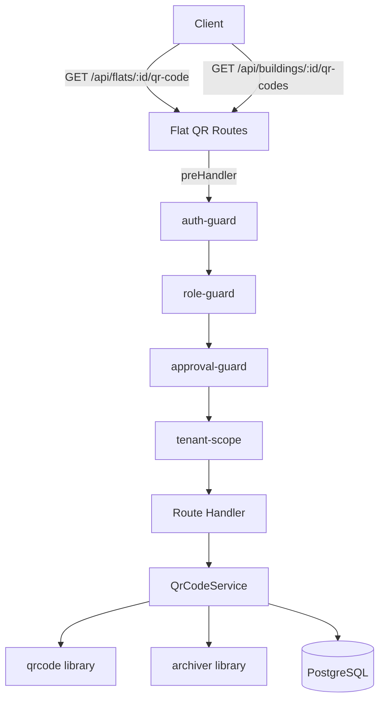

# Design Document: Flat QR Code Generation

## Overview

This feature adds QR code generation capabilities to the AmarSpace platform, allowing property owners and managers to generate QR codes for individual flats or entire buildings. Each QR code encodes a URL pointing to the flat's detail page, enabling physical identification and quick access via scanning.

The implementation introduces a new `QrCodeService` in the service layer, two new API endpoints (single flat and bulk building), and leverages the existing middleware stack (auth-guard, role-guard, tenant-scope) for access control. The `qrcode` npm package handles QR image generation, and `archiver` handles ZIP archive creation for bulk downloads.

## Architecture



**Key Design Decisions:**

1. **Library choice: `qrcode` (node-qrcode)** — The most popular Node.js QR code library with 1M+ weekly downloads, TypeScript types via `@types/qrcode`, supports PNG buffer output, configurable dimensions, and ISO/IEC 18004 compliance. No native dependencies required.

2. **Separate route file** — QR code routes are registered as a sub-plugin under the existing flat routes prefix or as a dedicated route file, following the project's route organization pattern.

3. **Service layer pattern** — A `QrCodeService` class encapsulates QR generation logic, consistent with `FlatService`, `BuildingService`, etc.

4. **Streaming ZIP for bulk** — Uses `archiver` to stream ZIP archives directly to the response, avoiding memory issues with large buildings.

5. **No database changes** — QR codes are generated on-demand from existing flat data. No new tables or columns needed.

## Components and Interfaces

### QrCodeService

```typescript
// apps/api/src/services/qr-code.ts

import QRCode from 'qrcode'
import archiver from 'archiver'
import type { Readable } from 'node:stream'

export interface QrCodeOptions {
  /** Pixel width/height of the QR code image. Default: 300 */
  size?: number
}

export interface QrCodeMetadata {
  flatId: string
  flatNumber: string
  buildingName: string
  encodedUrl: string
  imageBase64: string
}

export interface BulkQrCodeEntry {
  filename: string
  buffer: Buffer
}

export class QrCodeService {
  constructor(private baseUrl: string) {}

  /**
   * Builds the URL to encode in the QR code for a given flat.
   */
  buildFlatUrl(flatId: string): string

  /**
   * Generates a QR code PNG buffer for a single flat.
   */
  async generateQrCode(flatId: string, options?: QrCodeOptions): Promise<Buffer>

  /**
   * Generates a QR code and returns metadata with base64-encoded image.
   */
  async generateQrCodeWithMetadata(
    flat: { id: string; flatNumber: string },
    buildingName: string,
    options?: QrCodeOptions
  ): Promise<QrCodeMetadata>

  /**
   * Generates QR codes for multiple flats and returns a ZIP archive stream.
   */
  async generateBulkZipStream(
    flats: Array<{ id: string; flatNumber: string }>,
    buildingName: string,
    options?: QrCodeOptions
  ): Promise<Readable>

  /**
   * Validates the size parameter.
   * @throws ValidationError if size is outside [100, 1000]
   */
  validateSize(size?: number): number
}
```

### Route Handlers

```typescript
// apps/api/src/routes/flat-qr-code.ts

/**
 * GET /api/flats/:id/qr-code
 * 
 * Query params:
 *   - size?: number (100-1000, default 300)
 *   - format?: 'image' | 'metadata' (default 'image')
 * 
 * Responses:
 *   - 200: PNG image (Content-Type: image/png) or JSON metadata
 *   - 400: Invalid size parameter
 *   - 401: Unauthenticated
 *   - 403: Insufficient permissions
 *   - 404: Flat not found
 */

/**
 * GET /api/buildings/:id/qr-codes
 * 
 * Query params:
 *   - size?: number (100-1000, default 300)
 * 
 * Responses:
 *   - 200: ZIP archive (Content-Type: application/zip)
 *   - 400: Building has no flats / Invalid size
 *   - 401: Unauthenticated
 *   - 403: Insufficient permissions
 *   - 404: Building not found
 */
```

### Middleware Stack

Both endpoints use the same middleware chain as existing flat/building routes:

```typescript
preHandler: [authGuard, roleGuard(['owner', 'manager']), approvalGuard, tenantScope]
```

Access control logic within the handler:
- **Owner**: Can generate QR codes for any flat/building within their `ownerAccountId`
- **Manager**: Can only generate QR codes for flats in buildings within `tenantScope.assignedBuildingIds`

### Validation Schemas

```typescript
// Zod schemas for request validation

const qrCodeQuerySchema = z.object({
  size: z.coerce.number().int().min(100).max(1000).optional().default(300),
  format: z.enum(['image', 'metadata']).optional().default('image'),
})

const bulkQrCodeQuerySchema = z.object({
  size: z.coerce.number().int().min(100).max(1000).optional().default(300),
})

const flatIdParamSchema = z.object({
  id: z.string().uuid('Invalid flat ID format'),
})

const buildingIdParamSchema = z.object({
  id: z.string().uuid('Invalid building ID format'),
})
```

## Data Models

No new database tables are required. The feature operates on existing data:

### Existing Tables Used

- **`flats`** — `id`, `flatNumber`, `buildingId`, `ownerAccountId`
- **`buildings`** — `id`, `name`, `ownerAccountId`
- **`manager_assignments`** — Used indirectly via `tenantScope` middleware for manager access control

### Response Models

```typescript
// Single QR code metadata response
interface QrCodeMetadataResponse {
  flatId: string
  flatNumber: string
  buildingName: string
  encodedUrl: string
  imageBase64: string  // data:image/png;base64,... format
}

// Error response (reuses existing ApiErrorResponse)
interface ApiErrorResponse {
  requestId: string
  statusCode: number
  error: string
  message: string
}
```

### URL Format

The encoded URL follows the pattern:
```
{AUTH_BASE_URL}/flats/{flat_id}
```

Where `AUTH_BASE_URL` comes from the environment configuration (e.g., `https://app.amarspace.com`). This reuses the existing `AUTH_BASE_URL` env variable as the application's public-facing base URL.

## Correctness Properties

*A property is a characteristic or behavior that should hold true across all valid executions of a system — essentially, a formal statement about what the system should do. Properties serve as the bridge between human-readable specifications and machine-verifiable correctness guarantees.*

### Property 1: QR Code Round-Trip

*For any* valid flat ID and configured base URL, generating a QR code and then decoding the resulting PNG image SHALL yield the original URL in the format `{base_url}/flats/{flat_id}`.

**Validates: Requirements 1.1, 1.3, 3.1, 3.4**

### Property 2: Size Parameter Controls Output Dimensions

*For any* integer size value in the range [100, 1000], the generated QR code image SHALL have pixel dimensions equal to the specified size. *For any* size value outside [100, 1000], the service SHALL reject the request with a validation error.

**Validates: Requirements 1.2, 4.1, 4.2, 4.3**

### Property 3: Tenant-Scoped Access Control

*For any* flat and requesting user, QR code generation SHALL be permitted if and only if: (a) the user is an owner and the flat belongs to their `ownerAccountId`, OR (b) the user is a manager and the flat's `buildingId` is in their `assignedBuildingIds`. All other combinations SHALL be denied.

**Validates: Requirements 2.2, 2.3, 5.5**

### Property 4: Bulk Generation Produces Complete ZIP Archive

*For any* building with N flats (N ≥ 1), bulk QR code generation SHALL produce a ZIP archive containing exactly N PNG files, where each file is named `{building_name}_{flat_number}.png` and each PNG decodes to the correct flat URL.

**Validates: Requirements 5.1, 5.2, 5.3**

### Property 5: Metadata Response Completeness

*For any* flat with a valid building association, requesting QR code generation in metadata format SHALL return a JSON response containing the flat ID, flat number, building name, encoded URL, and a base64 string that decodes to a valid PNG image.

**Validates: Requirements 6.1, 6.3**

## Error Handling

| Scenario | Status Code | Error Message |
|----------|-------------|---------------|
| No authentication token | 401 | "Authentication required" |
| User lacks role (not owner/manager) | 403 | "Insufficient permissions" |
| Manager accessing unassigned building | 403 | "Insufficient permissions" |
| Flat ID not found | 404 | "Flat not found" |
| Building ID not found | 404 | "Building not found" |
| Size outside [100, 1000] | 400 | "Size must be between 100 and 1000 pixels" |
| Building has no flats | 400 | "Building has no flats to generate QR codes for" |
| QR generation library failure | 500 | "Failed to generate QR code" |

Error responses follow the existing `ApiErrorResponse` format with `requestId`, `statusCode`, `error`, and `message` fields.

**Manager access check** is performed in the route handler after `tenantScope` populates `assignedBuildingIds`:

```typescript
if (request.user.role === 'manager') {
  const assignedIds = request.tenantScope.assignedBuildingIds ?? []
  if (!assignedIds.includes(flat.buildingId)) {
    return reply.status(403).send({ /* ... */ })
  }
}
```

## Testing Strategy

### Property-Based Tests (fast-check)

The project already uses `fast-check` (v4.8.0) with Vitest. Property tests will be placed in `apps/api/tests/properties/qr-code.property.test.ts`.

**Configuration:**
- Minimum 100 iterations per property (project standard is 200)
- Each test tagged with: `Feature: flat-qr-code-generation, Property {N}: {title}`
- Uses `qrcode` for generation and a QR decoder library (e.g., `jsqr` or `@nuintun/qrcode`) for round-trip verification in tests

**Properties to implement:**
1. Round-trip: generate → decode → verify URL matches
2. Size control: valid sizes produce correct dimensions, invalid sizes throw
3. Access control: owner/manager scoping logic
4. Bulk ZIP: correct file count and naming
5. Metadata completeness: all fields present and base64 valid

### Unit Tests

Located in `apps/api/tests/unit/qr-code-service.test.ts`:
- Default size (300x300) when no size parameter provided
- 404 when flat doesn't exist
- 400 when building has no flats
- Correct Content-Type headers for image vs metadata responses
- ZIP Content-Disposition header for bulk downloads

### Integration Tests

Located in `apps/api/tests/integration/qr-code.test.ts`:
- Full request lifecycle through middleware stack
- Auth rejection for unauthenticated requests
- Role-based access verification with real middleware chain

### Dependencies to Add

```json
{
  "dependencies": {
    "qrcode": "^1.5.4",
    "archiver": "^7.0.1"
  },
  "devDependencies": {
    "@types/qrcode": "^1.5.5",
    "@types/archiver": "^6.0.3",
    "jsqr": "^1.4.0"
  }
}
```

- `qrcode` — QR code PNG generation (ISO/IEC 18004 compliant)
- `archiver` — ZIP archive streaming for bulk downloads
- `@types/qrcode` / `@types/archiver` — TypeScript definitions
- `jsqr` — QR code decoder for round-trip property tests (dev only)
