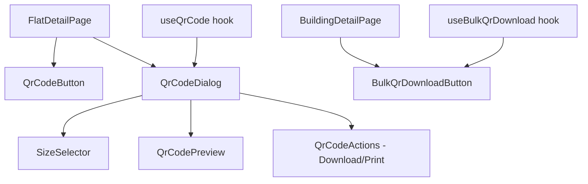
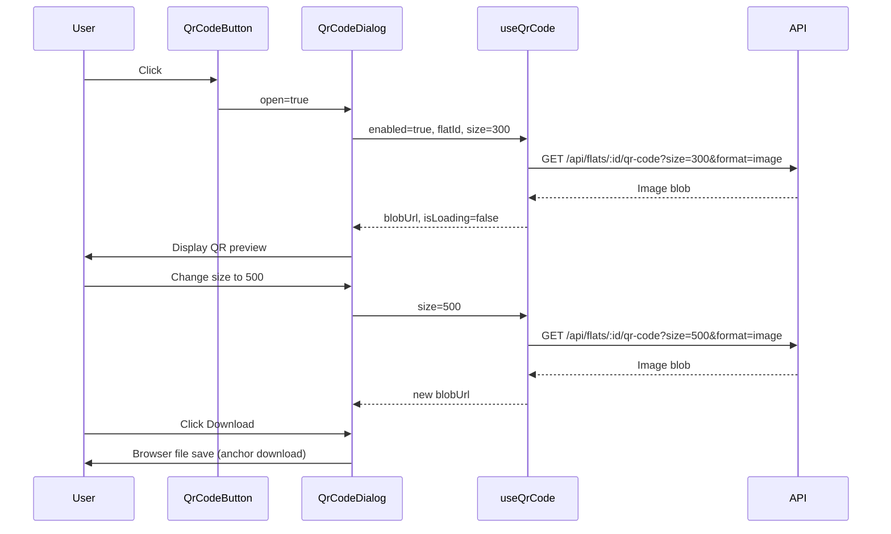

# Design Document: QR Code Feature UI

## Overview

This design describes the frontend implementation for QR code generation, preview, download, and print functionality in the AmarSpace platform. The feature adds a QR Code Dialog accessible from the flat detail page (`/flats/[id]`) and a bulk download button on the building detail page (`/buildings/[id]`).

The implementation follows existing project patterns: TanStack Query hooks for data fetching, Radix UI primitives for accessible dialogs, the `useTranslation` hook for i18n, and Tailwind CSS v4 for styling. The backend API endpoints already exist — this design covers only the client-side UI layer.

### Key Design Decisions

1. **Radix Dialog primitive** over AlertDialog — the QR code dialog is not a confirmation flow; it's a content preview with actions. A standard Dialog provides the right semantics (role="dialog", focus trap, Escape to close).
2. **Blob URL approach for image display** — the API returns an image binary (`format=image`). We fetch it as a blob, create an object URL, and display it in an `` tag. This avoids base64 overhead and enables direct download.
3. **Controlled dialog state** — the dialog open/close state lives in the parent page component, keeping the dialog stateless and testable.
4. **Dedicated `useQrCode` hook** — encapsulates TanStack Query logic, timeout handling, and retry count tracking in a single reusable hook.
5. **Print via hidden iframe** — avoids disrupting the current page layout. A hidden iframe receives the print content and calls `window.print()`.

## Architecture

### Component Hierarchy



### Data Flow



## Components and Interfaces

### QrCodeButton

**Location:** `apps/web/components/qr-code/qr-code-button.tsx`

```typescript
interface QrCodeButtonProps {
  flatId: string
  flatNumber: string
  buildingName: string
}
```

- Renders a `<Button>` with the `QrCode` icon from lucide-react and a localized label
- Minimum touch target: 44×44px (`min-h-[44px] min-w-[44px]`)
- `aria-label`: localized "Generate QR code for flat {flatNumber}" text
- Only rendered when user role is `owner` or `manager` (visibility controlled by parent)

### QrCodeDialog

**Location:** `apps/web/components/qr-code/qr-code-dialog.tsx`

```typescript
interface QrCodeDialogProps {
  open: boolean
  onOpenChange: (open: boolean) => void
  flatId: string
  flatNumber: string
  buildingName: string
}
```

Built on `@radix-ui/react-dialog` (not AlertDialog, since this is a content dialog):
- `role="dialog"`, `aria-modal="true"`, `aria-labelledby` referencing the title
- Focus trap and Escape-to-close handled by Radix
- Responsive: full-screen sheet below 640px, centered modal (max-w-[480px]) above 640px
- Contains: title, SizeSelector, QrCodePreview, action buttons (download, print, close)

**States:**
| State | UI |
|-------|-----|
| Loading | Spinner + "Generating..." message, buttons disabled |
| Success | QR image centered, buttons enabled |
| Error | Error message + retry button, download/print disabled |
| Retry exhausted (3 failures) | Error message, retry button disabled, "try again later" text |

### SizeSelector

**Location:** `apps/web/components/qr-code/size-selector.tsx`

```typescript
interface SizeSelectorProps {
  value: number
  onChange: (size: number) => void
  disabled?: boolean
}

const SIZE_OPTIONS = [200, 300, 500, 800] as const
```

- Implemented as a Radix `RadioGroup` for keyboard accessibility (arrow keys navigate, Enter/Space selects)
- Four radio buttons with localized labels (e.g., "200px", "300px")
- Default value: 300
- Layout: inline (`flex-row gap-2`) on ≥640px, stacked (`flex-col`) on <640px
- Each option has a minimum touch target of 44×44px

### BulkQrDownloadButton

**Location:** `apps/web/components/qr-code/bulk-qr-download-button.tsx`

```typescript
interface BulkQrDownloadButtonProps {
  buildingId: string
  buildingName: string
}
```

- Renders a `<Button>` with `Download` icon and localized "Download All QR Codes" label
- Shows a loading spinner and becomes disabled during download
- Only rendered when user role is `owner` or `manager`
- Minimum touch target: 44×44px

### QrCodePreview

**Location:** `apps/web/components/qr-code/qr-code-preview.tsx`

```typescript
interface QrCodePreviewProps {
  blobUrl: string | null
  flatNumber: string
  buildingName: string
  isLoading: boolean
  error: Error | null
  retryCount: number
  maxRetries: number
  onRetry: () => void
}
```

- Displays flat number and building name as header labels
- Shows the QR code image with `alt="QR code for flat {flatNumber} in {buildingName}"`
- Image: `max-w-full`, maintains aspect ratio, minimum 200×200px (150×150px on mobile)
- Loading state: centered spinner with localized "Generating..." text
- Error state: localized error message + retry button (disabled after 3 failures)

## Data Models

### Hook: useQrCode

**Location:** `apps/web/hooks/use-qr-code.ts`

```typescript
interface UseQrCodeOptions {
  flatId: string
  size?: number
  enabled?: boolean
}

interface UseQrCodeReturn {
  blobUrl: string | null
  isLoading: boolean
  error: Error | null
  retryCount: number
  retry: () => void
  isRetryDisabled: boolean
}
```

**Implementation details:**
- Uses `useQuery` with `queryKey: ['qr-code', flatId, size]`
- `queryFn` fetches `GET /api/flats/:id/qr-code?size={size}&format=image` as a blob
- Custom fetch (not `apiFetch`) since the response is binary, not JSON
- `signal` with `AbortController` and 15-second timeout
- `staleTime: 5 * 60 * 1000` (5 minutes — QR codes don't change frequently)
- `enabled` controlled by dialog open state
- Tracks `retryCount` via `useRef`; increments on error, resets on success
- `retry()` calls `queryClient.invalidateQueries` for the specific key
- `isRetryDisabled` returns `true` when `retryCount >= 3`
- Cleans up blob URLs via `useEffect` cleanup to prevent memory leaks

### Hook: useBulkQrDownload

**Location:** `apps/web/hooks/use-bulk-qr-download.ts`

```typescript
interface UseBulkQrDownloadOptions {
  buildingId: string
  buildingName: string
}

interface UseBulkQrDownloadReturn {
  download: () => void
  isDownloading: boolean
}
```

**Implementation details:**
- Uses `useMutation` (not `useQuery`) since this is a user-triggered one-shot action
- `mutationFn` fetches `GET /api/buildings/:id/qr-codes?size=300` as a blob
- 30-second timeout via `AbortController`
- On success: triggers file download with sanitized filename `{building_name}_qr_codes.zip`
- On error: shows toast with appropriate error message (network error, no flats, server error)
- Handles HTTP status codes: 404 (no flats message), 403 (permission denied), 5xx (generic error)

### Utility: sanitizeFilename

**Location:** `apps/web/lib/qr-code-utils.ts`

```typescript
/**
 * Replaces non-alphanumeric characters (except hyphens) with underscores.
 * Used for generating safe filenames from flat numbers and building names.
 */
export function sanitizeFilename(input: string): string {
  return input.replace(/[^a-zA-Z0-9\u0980-\u09FF-]/g, '_')
}

/**
 * Generates the download filename for a single flat QR code.
 */
export function getQrFilename(flatNumber: string): string {
  return `${sanitizeFilename(flatNumber)}_qr.png`
}

/**
 * Generates the download filename for a building's bulk QR ZIP.
 */
export function getBulkQrFilename(buildingName: string): string {
  return `${sanitizeFilename(buildingName)}_qr_codes.zip`
}

/**
 * Triggers a browser file download from a Blob.
 */
export function downloadBlob(blob: Blob, filename: string): void {
  const url = URL.createObjectURL(blob)
  const anchor = document.createElement('a')
  anchor.href = url
  anchor.download = filename
  document.body.appendChild(anchor)
  anchor.click()
  document.body.removeChild(anchor)
  URL.revokeObjectURL(url)
}
```

## Correctness Properties

*A property is a characteristic or behavior that should hold true across all valid executions of a system — essentially, a formal statement about what the system should do. Properties serve as the bridge between human-readable specifications and machine-verifiable correctness guarantees.*

### Property 1: Role-based visibility of QR actions

*For any* user role, the QR Code Button (on flat detail) and Bulk Download Button (on building detail) SHALL be visible if and only if the role is "owner" or "manager". For the "renter" role, both buttons SHALL be hidden.

**Validates: Requirements 1.1, 1.2, 6.1, 6.2**

### Property 2: Filename sanitization preserves safety

*For any* input string (flat number or building name), the `sanitizeFilename` function SHALL produce a string containing only alphanumeric characters (including Bengali Unicode range U+0980–U+09FF), hyphens, and underscores — no other characters SHALL appear in the output.

**Validates: Requirements 4.2, 6.4**

### Property 3: Dialog displays flat metadata in labels and alt text

*For any* flat number and building name combination, when the QR code is successfully loaded, the QR Code Dialog SHALL display both values as visible text labels above the image AND include both values in the image's alt attribute.

**Validates: Requirements 3.2, 3.6, 9.6**

### Property 4: Size selection triggers correct API parameter

*For any* size value selected from the Size Selector preset options (200, 300, 500, 800), the `useQrCode` hook SHALL include that exact value as the `size` query parameter in the API request URL.

**Validates: Requirements 2.3**

### Property 5: Aria-label contains flat identifier

*For any* flat number string and supported locale, the QR Code Button's `aria-label` attribute SHALL contain both the localized "Generate QR code" text and the flat number value.

**Validates: Requirements 9.4**

### Property 6: Translation key completeness

*For any* translation key used by the QR code feature components, the key SHALL resolve to a non-empty string in both the Bangla (bn) and English (en) locale dictionaries.

**Validates: Requirements 10.1, 10.3**

## Error Handling

### Error Classification and Response

| Error Type | HTTP Status | User Feedback | Recovery |
|-----------|-------------|---------------|----------|
| Permission denied | 403 | Toast: "permission denied" (5s) | None — button should not be visible |
| Flat not found | 404 | Toast: "flat not found" (5s) | Navigate back |
| Network error | N/A (fetch throws) | Dialog: "connection error" + retry button | Retry up to 3 times |
| Timeout (15s) | N/A (AbortError) | Dialog: "connection error" + retry button | Retry up to 3 times |
| Server error | 5xx | Dialog: error message + retry button | Retry up to 3 times |
| No flats in building | API-specific error | Toast: "no QR codes available" (5s) | None |
| Bulk download timeout (30s) | N/A (AbortError) | Toast: error message (5s) | Button re-enabled for manual retry |

### Retry Strategy

- Maximum 3 consecutive retries per dialog session
- Retry counter resets when dialog closes or a request succeeds
- After 3 failures: retry button disabled, message: "Please try again later"
- Each retry uses the same parameters (flatId + current size selection)

### Toast Feedback

Uses the existing `ErrorFeedback` component pattern (already in the project) or a lightweight toast utility:
- Success toasts: 4-second auto-dismiss
- Error toasts: 5-second auto-dismiss
- Only one toast visible at a time (new toast replaces previous)

## Testing Strategy

### Unit Tests (Example-Based)

- Dialog renders loading state with spinner and localized message
- Dialog renders success state with image, download button, print button
- Dialog renders error state with error message and retry button
- Retry button disables after 3 consecutive failures
- Download button and print button are disabled during loading and error states
- Size selector defaults to 300px
- Size selector displays exactly 4 options (200, 300, 500, 800)
- Bulk download button shows loading state during download
- Toast messages appear with correct duration (4s success, 5s error)
- Print button triggers `window.print()` with correct content
- Responsive layout: full-screen sheet below 640px, centered modal above

### Property-Based Tests

Property-based testing is appropriate for this feature because several behaviors involve pure functions with varied inputs (filename sanitization, role checking, metadata rendering).

**Library:** fast-check (already in devDependencies)
**Configuration:** Minimum 100 iterations per property test
**Location:** `apps/web/tests/properties/qr-code.property.test.ts`

Each property test references its design document property:
- **Feature: qr-code-feature-ui, Property 1**: Role-based visibility
- **Feature: qr-code-feature-ui, Property 2**: Filename sanitization
- **Feature: qr-code-feature-ui, Property 3**: Dialog metadata display
- **Feature: qr-code-feature-ui, Property 4**: Size parameter correctness
- **Feature: qr-code-feature-ui, Property 5**: Aria-label content
- **Feature: qr-code-feature-ui, Property 6**: Translation key completeness

### Integration Tests

- Full flow: open dialog → select size → verify API call → verify image display → download
- Bulk download: click button → verify API call → verify file download triggered
- Error recovery: simulate network failure → retry → succeed on second attempt
- Timeout: simulate slow response → verify abort after 15s → verify error state

## Print Functionality Implementation

### Approach: Hidden Iframe

```typescript
function printQrCode(blobUrl: string, flatNumber: string, buildingName: string): void {
  const iframe = document.createElement('iframe')
  iframe.style.position = 'fixed'
  iframe.style.left = '-9999px'
  iframe.style.width = '0'
  iframe.style.height = '0'
  document.body.appendChild(iframe)

  const doc = iframe.contentDocument
  if (!doc) return

  doc.open()
  doc.write(`
    <!DOCTYPE html>
    <html>
    <head>
      <title>QR Code - ${flatNumber}</title>
      <style>
        body { font-family: sans-serif; text-align: center; padding: 40px; }
        h1 { font-size: 18px; margin-bottom: 8px; }
        h2 { font-size: 14px; color: #666; margin-bottom: 24px; }
        img { width: 200px; height: 200px; min-width: 200px; min-height: 200px; }
      </style>
    </head>
    <body>
      <h1>${flatNumber}</h1>
      <h2>${buildingName}</h2>
      
    </body>
    </html>
  `)
  doc.close()

  iframe.contentWindow?.focus()
  iframe.contentWindow?.print()

  // Cleanup after print dialog closes
  setTimeout(() => document.body.removeChild(iframe), 1000)
}
```

### Print Layout

- Flat number as primary heading
- Building name as secondary heading
- QR code image at minimum 200×200px
- Centered layout, no other page elements

## File Download Implementation

### Single QR Code Download

1. User clicks download button
2. Get the existing blob URL from `useQrCode` hook state
3. Call `downloadBlob(blob, getQrFilename(flatNumber))`
4. Show success toast on completion, error toast on failure

### Bulk QR Code Download (ZIP)

1. User clicks bulk download button
2. `useBulkQrDownload` mutation fires: `GET /api/buildings/:id/qr-codes?size=300`
3. Response is a ZIP blob
4. Call `downloadBlob(blob, getBulkQrFilename(buildingName))`
5. Show success toast or error toast based on outcome

### Download Error Handling

The `downloadBlob` utility is synchronous (anchor click), so download failures are rare. However, if the blob fetch itself fails (network error, timeout), the error is caught by the hook and surfaced via toast.

## Responsive Behavior

### Breakpoint: 640px (sm)

| Element | < 640px | ≥ 640px |
|---------|---------|---------|
| QR Code Dialog | Full-screen sheet (100vw × 100vh) | Centered modal, max-w-[480px] |
| Size Selector | Vertical stack (`flex-col`) | Inline (`flex-row`) |
| Action buttons | Full-width, stacked | Inline, auto-width |
| QR image | max-w-full, min 150×150px | max-w-full, min 200×200px |
| Touch targets | All ≥ 44×44px | Standard sizing |

### Implementation

```typescript
// Dialog content classes
const dialogContentClasses = cn(
  // Mobile: full-screen sheet
  'fixed inset-0 z-50 flex flex-col bg-canvas p-6 overflow-y-auto',
  // Desktop: centered modal
  'sm:inset-auto sm:left-[50%] sm:top-[50%] sm:translate-x-[-50%] sm:translate-y-[-50%]',
  'sm:max-w-[480px] sm:w-full sm:max-h-[90vh] sm:rounded-xl sm:border sm:border-hairline sm:shadow-lg'
)
```

## Accessibility Implementation

### Dialog (Radix UI Dialog)

- `role="dialog"` and `aria-modal="true"` — provided by Radix
- `aria-labelledby` references the dialog title element
- Focus trap: Tab/Shift+Tab cycle within dialog — provided by Radix
- Focus return: on close, focus returns to trigger button — provided by Radix
- Escape key closes dialog — provided by Radix

### QR Code Button

```tsx
<Button
  aria-label={t('qrCode.generateAriaLabel', { flatNumber })}
  className="min-h-[44px] min-w-[44px]"
>
  <QrCode className="h-4 w-4" />
  <span>{t('qrCode.button')}</span>
</Button>
```

### Size Selector (Radix RadioGroup)

- Arrow keys navigate between options
- Enter/Space confirms selection
- Each radio item has an accessible label
- Group has `aria-label` for the selector purpose

### Image

```tsx

```

### Contrast

All interactive elements use the existing design tokens (`text-ink` on `bg-canvas`, `text-on-dark` on `bg-primary`) which maintain ≥4.5:1 contrast ratio per the project's established color system.

## i18n Integration

### Translation Keys

All QR code feature text uses the `qrCode` namespace in the translation dictionaries:

```typescript
// Translation key structure
{
  qrCode: {
    button: "QR Code" | "কিউআর কোড",
    dialogTitle: "QR Code Preview" | "কিউআর কোড প্রিভিউ",
    sizeLabel: "Size" | "সাইজ",
    size200: "200px",
    size300: "300px",
    size500: "500px",
    size800: "800px",
    generating: "Generating..." | "তৈরি হচ্ছে...",
    download: "Download" | "ডাউনলোড",
    print: "Print" | "প্রিন্ট",
    close: "Close" | "বন্ধ করুন",
    retry: "Retry" | "পুনরায় চেষ্টা",
    tryAgainLater: "Please try again later" | "পরে আবার চেষ্টা করুন",
    downloadSuccess: "QR code downloaded" | "কিউআর কোড ডাউনলোড হয়েছে",
    downloadError: "Download failed" | "ডাউনলোড ব্যর্থ হয়েছে",
    connectionError: "Connection error" | "সংযোগ ত্রুটি",
    permissionDenied: "Permission denied" | "অনুমতি নেই",
    flatNotFound: "Flat not found" | "ফ্ল্যাট পাওয়া যায়নি",
    bulkDownload: "Download All QR Codes" | "সব কিউআর কোড ডাউনলোড",
    bulkDownloadSuccess: "QR codes downloaded" | "কিউআর কোড ডাউনলোড হয়েছে",
    bulkDownloadError: "Bulk download failed" | "বাল্ক ডাউনলোড ব্যর্থ হয়েছে",
    noQrCodesAvailable: "No QR codes available" | "কোনো কিউআর কোড নেই",
    generateAriaLabel: "Generate QR code for flat {{flatNumber}}" | "ফ্ল্যাট {{flatNumber}} এর জন্য কিউআর কোড তৈরি করুন",
    imageAlt: "QR code for flat {{flatNumber}} in {{buildingName}}" | "{{buildingName}} এ ফ্ল্যাট {{flatNumber}} এর কিউআর কোড"
  }
}
```

### Reactive Updates

Since the `useTranslation` hook reads from React context, all text updates reactively when `setLocale` is called — no page reload or dialog remount needed. The `t()` function is memoized on `activeLocale`, so it re-renders only when the locale actually changes.

### Fallback Behavior

The existing i18n provider already falls back to English when a key is missing from the active locale dictionary. No additional fallback logic is needed in the QR code components.
