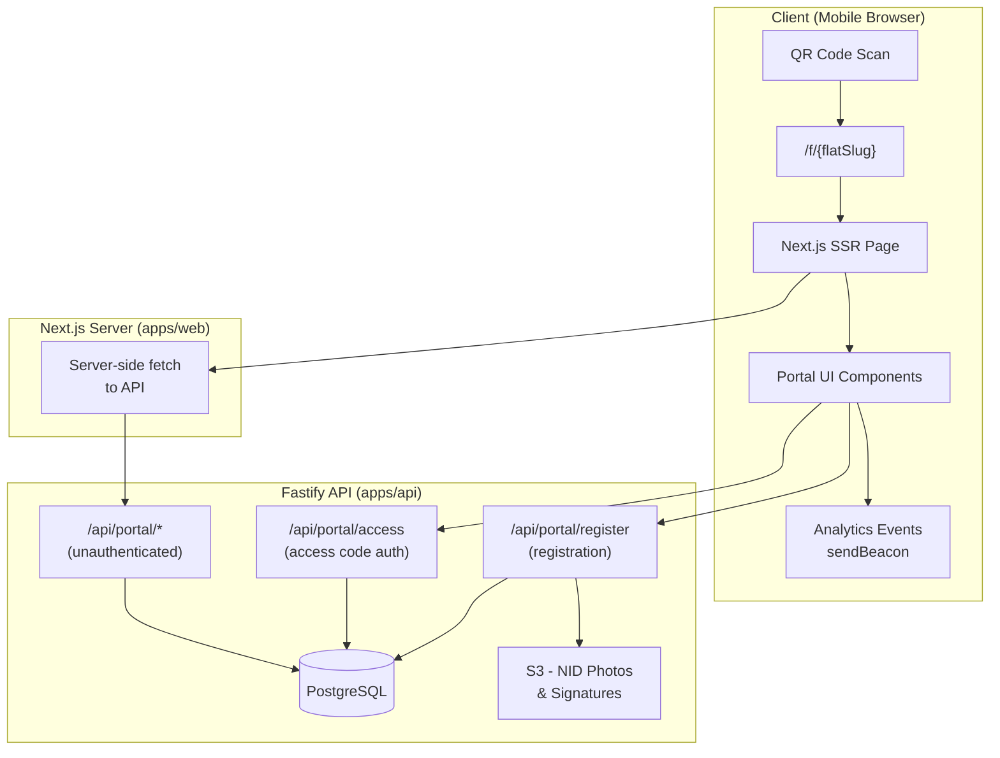

# Design Document: Renter QR Portal

## Overview

The Renter QR Portal is a public-facing, mobile-first web experience served at `/f/{flatSlug}`. When a flat's QR code is scanned, the portal renders building information, quick actions, notices, emergency contacts, renter registration (for available flats), and access code authentication (for occupied flats). The portal is Bangla-first, designed for elderly and non-technical users, and must load quickly on mobile networks.

### Key Design Decisions

1. **Next.js App Router with Server Components** — The portal page at `/f/[flatSlug]` uses server-side rendering for fast first load and SEO. Dynamic data (notices, registration form state) hydrates on the client via React Server Components + TanStack Query.

2. **Dedicated public API routes** — A new set of unauthenticated Fastify routes (`/api/portal/*`) serve only public data (building name, flat status, public notices, emergency contacts). Private data is never included in these responses.

3. **Flat slug as a new column** — A `slug` column is added to the `flats` table, generated from building name + flat number, providing a URL-friendly identifier that doesn't expose internal UUIDs.

4. **Access code session via HTTP-only cookie** — Renter authentication uses a short-lived (30-minute) session stored server-side, with a secure HTTP-only cookie. Rate limiting (5 attempts / 15-minute lockout) is enforced server-side.

5. **Registration requests as a new table** — A `registration_requests` table stores prospective renter submissions with `PENDING_APPROVAL` status, decoupled from the existing `renters` table.

6. **Analytics via fire-and-forget events** — Analytics events are sent asynchronously from the client using `navigator.sendBeacon` or a non-blocking fetch, never blocking UI interactions.

## Architecture



### Request Flow

1. User scans QR code → browser navigates to `/f/{flatSlug}`
2. Next.js server component validates the slug format client-side, then fetches portal data from `GET /api/portal/flat/{flatSlug}`
3. API resolves slug → returns public flat data (building info, status, notices, emergency contacts, quick action config)
4. Page renders server-side with all public data; no additional client-side fetches needed for initial view
5. Interactive actions (registration form submission, access code entry) use client-side mutations via TanStack Query

## Components and Interfaces

### Frontend Components (apps/web)

```
app/f/[flatSlug]/
├── page.tsx                    # Server component - fetches portal data
├── layout.tsx                  # Portal-specific layout (no auth sidebar)
├── error.tsx                   # Error boundary with Bangla messages
├── loading.tsx                 # Skeleton loading state
└── components/
    ├── portal-header.tsx       # Building name, flat number, status badge
    ├── quick-actions-grid.tsx  # 2-column grid of action buttons
    ├── notice-board.tsx        # Expandable notice cards
    ├── emergency-contacts.tsx  # Contact list with call buttons
    ├── building-info.tsx       # Rich text building rules
    ├── registration-form.tsx   # Multi-field registration (client component)
    ├── access-code-input.tsx   # 6-digit PIN input (client component)
    ├── signature-pad.tsx       # Touch-based signature capture
    └── status-badge.tsx        # Colored status indicator
```

### API Routes (apps/api)

| Endpoint | Method | Auth | Description |
|----------|--------|------|-------------|
| `/api/portal/flat/:slug` | GET | None | Public flat portal data |
| `/api/portal/flat/:slug/notices` | GET | None | Public notices for the flat's building |
| `/api/portal/flat/:slug/register` | POST | None | Submit registration request |
| `/api/portal/flat/:slug/access` | POST | None | Verify access code, create session |
| `/api/portal/analytics` | POST | None | Track analytics events |

### API Response Interfaces

```typescript
// GET /api/portal/flat/:slug
interface PortalFlatResponse {
  building: {
    name: string
    logoUrl: string | null
    coverImageUrl: string | null
    whatsappGroupLink: string | null
    managerPhone: string | null
    rules: string | null  // Rich text (HTML)
  }
  flat: {
    flatNumber: string
    status: 'AVAILABLE' | 'OCCUPIED' | 'MAINTENANCE'
    slug: string
  }
  emergencyContacts: Array<{
    name: string
    role: string        // Bangla role label
    phone: string | null
    type: 'building' | 'nearby'
    order: number
  }>
  hasPendingRegistration: boolean  // For duplicate check (by flat only)
}

// GET /api/portal/flat/:slug/notices
interface PortalNoticesResponse {
  notices: Array<{
    id: string
    title: string
    body: string
    createdAt: string   // ISO 8601
    isPinned: boolean
  }>
}

// POST /api/portal/flat/:slug/register
interface RegistrationRequestBody {
  fullName: string
  phone: string
  nidNumber: string
  bloodGroup: string
  occupation: string
  familyMembers: number
  emergencyContact: string
  rentalStartDate: string       // YYYY-MM-DD
  advanceAmount: number
  digitalSignature: string      // Base64 PNG
  nidPhoto?: string             // Base64 JPEG/PNG (optional)
}

interface RegistrationResponse {
  success: boolean
  message: string               // Bangla confirmation message
  requestId: string
}

// POST /api/portal/flat/:slug/access
interface AccessCodeRequest {
  code: string                  // 6-digit numeric string
}

interface AccessCodeResponse {
  success: boolean
  message: string
  redirectUrl?: string          // "/renter/dashboard" on success
}

// POST /api/portal/analytics
interface AnalyticsEventRequest {
  event: string
  flatSlug: string
  timestamp: string
  userAgent: string
  metadata?: Record<string, string>
}
```

## Data Models

### New Tables

#### `flat_slugs` (maps slugs to flats)

| Column | Type | Constraints | Description |
|--------|------|-------------|-------------|
| id | UUID | PK, default random | Primary key |
| flat_id | UUID | FK → flats.id, UNIQUE, NOT NULL | Reference to flat |
| slug | VARCHAR(100) | UNIQUE, NOT NULL | URL-friendly slug |
| created_at | TIMESTAMPTZ | NOT NULL, default now | Creation timestamp |

#### `registration_requests`

| Column | Type | Constraints | Description |
|--------|------|-------------|-------------|
| id | UUID | PK, default random | Primary key |
| flat_id | UUID | FK → flats.id, NOT NULL | Target flat |
| owner_account_id | TEXT | FK → users.id, NOT NULL | Building owner |
| full_name | VARCHAR(100) | NOT NULL | Applicant name |
| phone | VARCHAR(11) | NOT NULL | BD mobile number |
| nid_number | VARCHAR(17) | NOT NULL | National ID |
| nid_photo_url | VARCHAR(500) | NULLABLE | S3 URL for NID photo |
| blood_group | VARCHAR(3) | NOT NULL | Blood group |
| occupation | VARCHAR(100) | NOT NULL | Occupation |
| family_members | INTEGER | NOT NULL | Family member count |
| emergency_contact | VARCHAR(11) | NOT NULL | Emergency phone |
| rental_start_date | DATE | NOT NULL | Desired start date |
| advance_amount | NUMERIC(12,2) | NOT NULL | Advance payment amount |
| digital_signature_url | VARCHAR(500) | NOT NULL | S3 URL for signature |
| status | VARCHAR(20) | NOT NULL, default 'PENDING_APPROVAL' | Request status |
| created_at | TIMESTAMPTZ | NOT NULL, default now | Submission time |
| updated_at | TIMESTAMPTZ | NOT NULL, default now | Last update |

**Unique constraint:** `(flat_id, phone)` WHERE `status = 'PENDING_APPROVAL'` — prevents duplicate pending requests.

#### `emergency_contacts`

| Column | Type | Constraints | Description |
|--------|------|-------------|-------------|
| id | UUID | PK, default random | Primary key |
| building_id | UUID | FK → buildings.id, NOT NULL | Building reference |
| owner_account_id | TEXT | FK → users.id, NOT NULL | Building owner |
| name | VARCHAR(100) | NOT NULL | Contact name |
| role | VARCHAR(50) | NOT NULL | Role (e.g., "মালিক", "ম্যানেজার") |
| phone | VARCHAR(20) | NULLABLE | Phone number |
| type | VARCHAR(20) | NOT NULL | 'building' or 'nearby' |
| sort_order | INTEGER | NOT NULL | Display order |
| created_at | TIMESTAMPTZ | NOT NULL, default now | Creation timestamp |
| updated_at | TIMESTAMPTZ | NOT NULL, default now | Last update |

#### `renter_access_codes`

| Column | Type | Constraints | Description |
|--------|------|-------------|-------------|
| id | UUID | PK, default random | Primary key |
| flat_id | UUID | FK → flats.id, NOT NULL | Flat reference |
| renter_id | UUID | FK → renters.id, NOT NULL | Renter reference |
| code_hash | VARCHAR(255) | NOT NULL | Hashed 6-digit code |
| failed_attempts | INTEGER | NOT NULL, default 0 | Consecutive failures |
| locked_until | TIMESTAMPTZ | NULLABLE | Lockout expiry |
| created_at | TIMESTAMPTZ | NOT NULL, default now | Creation timestamp |
| updated_at | TIMESTAMPTZ | NOT NULL, default now | Last update |

#### `portal_sessions`

| Column | Type | Constraints | Description |
|--------|------|-------------|-------------|
| id | UUID | PK, default random | Session ID |
| flat_id | UUID | FK → flats.id, NOT NULL | Flat reference |
| renter_id | UUID | FK → renters.id, NOT NULL | Renter reference |
| expires_at | TIMESTAMPTZ | NOT NULL | Session expiry (30 min) |
| created_at | TIMESTAMPTZ | NOT NULL, default now | Creation timestamp |

#### `analytics_events`

| Column | Type | Constraints | Description |
|--------|------|-------------|-------------|
| id | UUID | PK, default random | Event ID |
| event_name | VARCHAR(50) | NOT NULL | Event type |
| flat_slug | VARCHAR(100) | NOT NULL | Flat slug |
| user_agent | TEXT | NULLABLE | Browser user agent |
| metadata | JSONB | NULLABLE | Additional event data |
| created_at | TIMESTAMPTZ | NOT NULL, default now | Event timestamp |

### Modifications to Existing Tables

#### `buildings` — new columns

| Column | Type | Description |
|--------|------|-------------|
| whatsapp_group_link | VARCHAR(500) | WhatsApp group invite URL |
| manager_phone | VARCHAR(20) | Manager's phone number |
| logo_url | VARCHAR(500) | Building logo image URL |
| cover_image_url | VARCHAR(500) | Building cover image URL |
| rules | TEXT | Building rules (rich text/HTML, max 50,000 chars) |

#### `flats` — status value mapping

The existing `status` column uses values `vacant`, `occupied`, `under_maintenance`. The portal maps these to the requirement's terminology:
- `vacant` → `AVAILABLE` (displayed as "খালি")
- `occupied` → `OCCUPIED` (displayed as "ভাড়া হয়েছে")
- `under_maintenance` → `MAINTENANCE` (displayed as "রক্ষণাবেক্ষণ")

## Correctness Properties

*A property is a characteristic or behavior that should hold true across all valid executions of a system — essentially, a formal statement about what the system should do. Properties serve as the bridge between human-readable specifications and machine-verifiable correctness guarantees.*

### Property 1: Flat slug validation

*For any* string, the slug validation function SHALL accept it if and only if it consists exclusively of lowercase alphanumeric characters (a-z, 0-9) and hyphens, with a length between 1 and 100 characters inclusive. All other strings SHALL be rejected without triggering a database lookup.

**Validates: Requirements 1.3, 1.5**

### Property 2: Building name truncation

*For any* building name string, the display formatter SHALL return the string unchanged if its length is 100 characters or fewer, and SHALL return the first 100 characters followed by an ellipsis ("…") if its length exceeds 100 characters.

**Validates: Requirements 2.1**

### Property 3: Notice list formatting invariants

*For any* list of notices, the portal's notice formatting function SHALL: (a) return notices sorted in reverse chronological order (most recent first), (b) truncate each notice description to a maximum of 120 characters, and (c) return at most 20 notices regardless of input list size.

**Validates: Requirements 4.1, 4.2**

### Property 4: Emergency contact role ordering

*For any* set of building emergency contacts with roles from {Owner, Manager, Caretaker, Security}, the display order SHALL always follow the sequence Owner → Manager → Caretaker → Security, with contacts of the same role maintaining their original relative order.

**Validates: Requirements 5.1**

### Property 5: Registration form validation

*For any* registration form input, the validation function SHALL accept the input if and only if all required fields satisfy their constraints: Full Name (1–100 chars), Phone (11 digits starting with 01), NID (10 or 17 digits), Blood Group (one of A+, A−, B+, B−, O+, O−, AB+, AB−), Occupation (1–100 chars), Family Members (integer 1–20), Emergency Contact (11 digits starting with 01), Rental Start Date (current or future within 90 days), Advance Amount (0–99,999,999), and Digital Signature (at least 1 stroke). For any invalid input, the function SHALL produce a Bangla error message for each invalid field.

**Validates: Requirements 7.2, 7.7**

### Property 6: Duplicate registration prevention

*For any* flat and phone number combination that already has a registration request with PENDING_APPROVAL status, a subsequent registration submission with the same phone number and flat SHALL be rejected with an appropriate message.

**Validates: Requirements 7.9**

### Property 7: Access code rate limiting

*For any* sequence of access code verification attempts on a given flat, if 5 consecutive invalid attempts occur, the system SHALL lock the access code input for exactly 15 minutes. During the lockout period, all further attempts SHALL be rejected regardless of code validity.

**Validates: Requirements 8.5**

### Property 8: Public API data exclusion

*For any* response from the unauthenticated portal API endpoints (`/api/portal/*`), the response body SHALL never contain any of the following private data fields: NID numbers, payment history, rent amounts, family member details, contract information, deposit information, issue reports, or private notices.

**Validates: Requirements 9.1, 9.2**

### Property 9: Analytics event structure

*For any* analytics event tracked by the portal, the event payload SHALL always contain a non-empty `flat_slug` string and a valid ISO 8601 `timestamp` field.

**Validates: Requirements 13.2**

## Error Handling

### Client-Side Error Handling

| Scenario | Behavior |
|----------|----------|
| Invalid slug format | Display "অবৈধ QR কোড" immediately (no API call) |
| Flat not found (404) | Display "ফ্ল্যাটটি পাওয়া যায়নি" with error icon |
| API timeout / network error | Display Bangla error with "আবার চেষ্টা করুন" retry button |
| Registration validation failure | Field-level Bangla error messages adjacent to each invalid field |
| Access code invalid | Bangla error message, clear input, increment attempt counter |
| Access code lockout | Display lockout message with remaining time in Bangla |
| Session expired | Redirect to `/f/{flatSlug}` with session expired message |
| Empty data sections | Display section-specific Bangla empty state with icon |

### Server-Side Error Handling

| Scenario | HTTP Status | Response |
|----------|-------------|----------|
| Invalid slug format | 400 | `{ error: "INVALID_SLUG", message: "অবৈধ QR কোড" }` |
| Flat not found | 404 | `{ error: "FLAT_NOT_FOUND", message: "ফ্ল্যাটটি পাওয়া যায়নি" }` |
| Duplicate registration | 409 | `{ error: "DUPLICATE_REQUEST", message: "..." }` |
| Invalid access code | 401 | `{ error: "INVALID_CODE", message: "...", attemptsRemaining: N }` |
| Access code locked | 429 | `{ error: "LOCKED", message: "...", lockedUntil: ISO8601 }` |
| File too large | 413 | `{ error: "FILE_TOO_LARGE", message: "..." }` |
| Invalid file type | 415 | `{ error: "INVALID_FILE_TYPE", message: "..." }` |
| Server error | 500 | `{ error: "INTERNAL_ERROR", message: "সার্ভারে সমস্যা হয়েছে" }` |

### Error Recovery Strategy

- All API errors return structured JSON with Bangla `message` field
- Client displays the `message` directly to the user
- Network failures trigger automatic retry with exponential backoff (max 3 retries)
- Analytics failures are silently discarded (never shown to user)
- Form data is preserved in component state during validation errors (user doesn't lose input)

## Testing Strategy

### Property-Based Tests (fast-check)

The project already uses `fast-check` (v4.8.0) across all packages. Property tests will be placed in:
- `apps/web/tests/properties/` — Frontend validation and formatting logic
- `apps/api/tests/properties/` — API validation, rate limiting, data exclusion
- `packages/shared/tests/properties/` — Shared validation schemas

Each property test:
- Runs a minimum of 100 iterations
- References its design document property via tag comment
- Format: `// Feature: renter-qr-portal, Property N: {property_text}`

**Property tests to implement:**
1. Slug validation (shared validation)
2. Building name truncation (web formatting utility)
3. Notice list formatting (web formatting utility)
4. Emergency contact ordering (web/API sorting logic)
5. Registration form validation (shared validation schema)
6. Duplicate registration prevention (API service layer with mocked DB)
7. Access code rate limiting (API service layer with mocked DB)
8. Public API data exclusion (API route response verification)
9. Analytics event structure (shared type/validation)

### Unit Tests (vitest)

- Status badge mapping (exhaustive: 3 known + 1 fallback)
- Bangla date formatting (specific date examples)
- Conditional rendering (WhatsApp button visibility, registration form visibility)
- Empty state messages for each section
- Access code input (numeric-only filtering)
- Session expiry redirect logic

### Integration Tests

- Full portal page load with valid slug (SSR verification)
- Registration form submission end-to-end
- Access code authentication flow
- Rate limiting with 5 failed attempts
- Unauthenticated access to private endpoints (security)

### Accessibility Tests

- axe-core automated checks on rendered portal page
- Touch target size verification (48x48px minimum)
- Contrast ratio checks (WCAG AA)
- Viewport responsiveness (360px–768px)

### Performance Tests

- Lighthouse CI in CI/CD pipeline (LCP ≤ 2s, FCP ≤ 1s)
- Bundle size check (JS ≤ 200KB compressed)
- Transfer size check (initial load ≤ 500KB)

