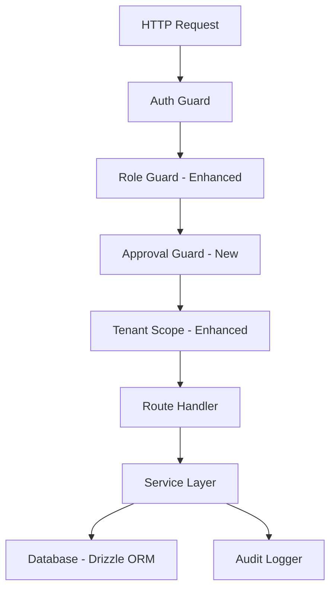
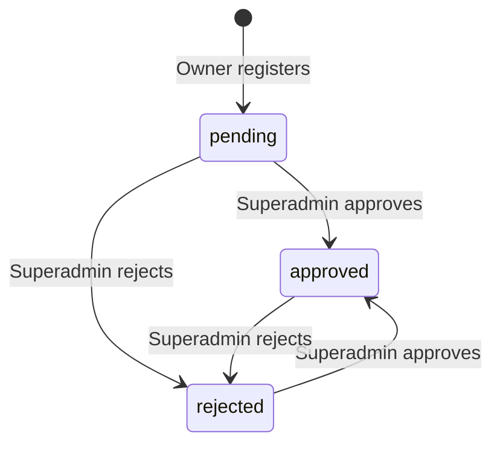

# Design Document: Role-Based User Management

## Overview

This design extends the AmarSpace platform's existing role system (`owner`, `manager`, `renter`) with a `superadmin` role for platform-level administration and formalizes the owner-to-manager user creation flow. The implementation builds on the existing Fastify middleware stack (auth-guard → role-guard → tenant-scope), Drizzle ORM schema, and better-auth session management.

Key capabilities introduced:
- **Superadmin role** with platform-wide access, bypassing tenant scoping
- **Owner account approval workflow** (pending → approved/rejected) gated by superadmin
- **Manager creation by owners** with building assignments and temporary password generation
- **User management endpoints** for superadmin (list, deactivate, dashboard stats)
- **Enhanced role-guard** supporting both explicit role lists and hierarchical access

## Architecture

The feature follows the existing layered architecture:



### Middleware Pipeline Changes

1. **Auth Guard** — Extended to recognize `superadmin` role and inject it into `request.user`
2. **Role Guard** — Enhanced with two modes: explicit role list (current behavior) and hierarchical check (new). Superadmin always passes.
3. **Approval Guard** — New middleware that blocks unapproved owners from resource-management endpoints
4. **Tenant Scope** — Enhanced to skip scoping for superadmin (platform-wide access)

### New Route Groups

| Prefix | Purpose | Access |
|--------|---------|--------|
| `/api/admin/owners` | Owner approval workflow | superadmin |
| `/api/admin/users` | Platform user management | superadmin |
| `/api/admin/dashboard` | Platform statistics | superadmin |
| `/api/managers` | Manager CRUD by owners | owner |

## Components and Interfaces

### Middleware: Enhanced Auth Guard

```typescript
// Updated AuthUser interface
export interface AuthUser {
  id: string
  role: 'superadmin' | 'owner' | 'manager' | 'renter'
  ownerAccountId: string
  email: string
  approvalStatus?: 'pending' | 'approved' | 'rejected'
  isActive?: boolean
}
```

The auth guard will read the `role`, `approvalStatus`, and `isActive` fields from the session user and inject them into the request context. If `isActive` is `false`, the guard returns 401 immediately and invalidates the session.

### Middleware: Enhanced Role Guard

```typescript
// Role hierarchy ordinals
const ROLE_HIERARCHY: Record<string, number> = {
  superadmin: 4,
  owner: 3,
  manager: 2,
  renter: 1,
}

// Two usage modes:
// 1. Explicit list (current): roleGuard(['owner', 'manager'])
// 2. Hierarchical: roleGuard({ minRole: 'manager' })
export function roleGuard(
  config: Role[] | { minRole: Role }
): FastifyPreHandler
```

Superadmin always passes the role guard regardless of configuration.

### Middleware: Approval Guard (New)

```typescript
/**
 * Blocks owners with pending/rejected approval status from
 * resource-management endpoints. Superadmin bypasses this check.
 */
export function approvalGuard(
  request: FastifyRequest,
  reply: FastifyReply
): Promise<void>
```

Applied to all building, flat, renter, payment, bill, deposit, maintenance, notice, and issue routes.

### Middleware: Enhanced Tenant Scope

The tenant scope middleware is updated to skip scoping for superadmin users, allowing them to access resources across all owner accounts.

```typescript
export async function tenantScope(
  request: FastifyRequest,
  _reply: FastifyReply,
): Promise<void> {
  const { user } = request

  // Superadmin bypasses tenant scoping
  if (user.role === 'superadmin') {
    request.tenantScope = { ownerAccountId: '__all__' }
    return
  }
  // ... existing logic for owner/manager/renter
}
```

### Service: OwnerApprovalService

```typescript
export class OwnerApprovalService {
  constructor(private db: Database, private auditLogger: AuditLogger) {}

  async listOwners(params: {
    page: number
    pageSize: number
    status?: ApprovalStatus
  }): Promise<PaginatedResult<OwnerListItem>>

  async updateApprovalStatus(
    actorId: string,
    ownerId: string,
    newStatus: ApprovalStatus
  ): Promise<void>
}
```

### Service: ManagerService

```typescript
export class ManagerService {
  constructor(private db: Database, private auditLogger: AuditLogger) {}

  async createManager(
    ctx: RequestContext,
    input: CreateManagerInput
  ): Promise<CreateManagerResult>

  async listManagers(
    ctx: RequestContext,
    pagination: PaginationInput
  ): Promise<PaginatedResult<ManagerListItem>>

  async updateAssignments(
    ctx: RequestContext,
    managerId: string,
    buildingIds: string[]
  ): Promise<void>

  async removeAssignment(
    ctx: RequestContext,
    managerId: string,
    buildingId: string
  ): Promise<void>
}
```

### Service: AdminUserService

```typescript
export class AdminUserService {
  constructor(private db: Database, private auditLogger: AuditLogger) {}

  async listUsers(params: {
    page: number
    pageSize: number
    role?: string
  }): Promise<PaginatedResult<AdminUserListItem>>

  async deactivateUser(
    actorId: string,
    targetUserId: string
  ): Promise<void>

  async getDashboardStats(): Promise<DashboardStats>
}
```

### Route Handlers

**Admin routes** (`/api/admin/*`):
- `GET /api/admin/owners` — List owners with approval status filter
- `PUT /api/admin/owners/:id/status` — Update owner approval status
- `GET /api/admin/users` — List all users with role filter
- `PUT /api/admin/users/:id/deactivate` — Deactivate a user
- `GET /api/admin/dashboard` — Platform statistics

**Manager routes** (`/api/managers`):
- `POST /api/managers` — Create a manager (owner only)
- `GET /api/managers` — List managers for owner's account
- `PUT /api/managers/:id/assignments` — Update building assignments

## Data Models

### Schema Changes

#### Users Table — New Columns

```typescript
// packages/db/src/schema/users.ts — additions
export const users = pgTable('users', {
  // ... existing columns ...
  role: varchar('role', { length: 20 }).notNull().default('owner'),
  // NEW: approval status for owner accounts
  approvalStatus: varchar('approval_status', { length: 20 }).default('pending'),
  // NEW: account active flag (for deactivation)
  isActive: boolean('is_active').notNull().default(true),
  // NEW: deactivated timestamp
  deactivatedAt: timestamp('deactivated_at', { withTimezone: true }),
})
```

The `role` column already exists and accepts string values. We add `'superadmin'` as a valid value. The `approvalStatus` column is nullable — it only applies to owner accounts (null for manager/renter/superadmin). The `isActive` flag defaults to `true` and is set to `false` on deactivation.

#### Approval Status Transitions



Valid transitions:
- `pending` → `approved`
- `pending` → `rejected`
- `rejected` → `approved`
- `approved` → `rejected`

Invalid transitions (return 400):
- `approved` → `pending`
- `rejected` → `pending`

#### Manager Assignments Table (Existing)

The `manager_assignments` table already exists with the correct structure:
- `id` (UUID, PK)
- `ownerAccountId` (FK → users.id)
- `managerId` (FK → users.id)
- `buildingId` (FK → buildings.id)
- `assignedAt` (timestamp)
- Unique constraint on (managerId, buildingId)

No schema changes needed for this table.

### TypeScript Types

```typescript
// Approval status type
export type ApprovalStatus = 'pending' | 'approved' | 'rejected'

// Extended role type
export type UserRole = 'superadmin' | 'owner' | 'manager' | 'renter'

// Role hierarchy ordinals
export const ROLE_ORDINALS: Record<UserRole, number> = {
  superadmin: 4,
  owner: 3,
  manager: 2,
  renter: 1,
}

// Valid approval status transitions
export const VALID_APPROVAL_TRANSITIONS: Record<ApprovalStatus, ApprovalStatus[]> = {
  pending: ['approved', 'rejected'],
  approved: ['rejected'],
  rejected: ['approved'],
}

// Manager creation input
export interface CreateManagerInput {
  email: string       // max 254 chars
  name: string        // 1-200 chars
  buildingIds: string[] // 1-20 UUIDs
}

// Manager creation result (includes temporary password)
export interface CreateManagerResult {
  id: string
  email: string
  name: string
  role: 'manager'
  buildingIds: string[]
  temporaryPassword: string
}

// Dashboard statistics
export interface DashboardStats {
  usersByRole: { owner: number; manager: number; renter: number }
  pendingApprovals: number
  activeSessions: number
}
```

### Temporary Password Generation

Temporary passwords are generated server-side using `crypto.randomBytes` with the following constraints:
- Minimum 12 characters
- Must contain: uppercase, lowercase, numeric, and special characters
- Generated using a character pool approach with `crypto.getRandomValues` for cryptographic randomness

```typescript
import { randomBytes } from 'node:crypto'

export function generateTemporaryPassword(length = 16): string {
  const uppercase = 'ABCDEFGHIJKLMNOPQRSTUVWXYZ'
  const lowercase = 'abcdefghijklmnopqrstuvwxyz'
  const numbers = '0123456789'
  const special = '!@#$%^&*'
  const allChars = uppercase + lowercase + numbers + special

  // Ensure at least one of each required type
  const required = [
    uppercase[randomBytes(1)[0] % uppercase.length],
    lowercase[randomBytes(1)[0] % lowercase.length],
    numbers[randomBytes(1)[0] % numbers.length],
    special[randomBytes(1)[0] % special.length],
  ]

  // Fill remaining with random chars from the full pool
  const remaining = Array.from(randomBytes(length - 4), (byte) =>
    allChars[byte % allChars.length]
  )

  // Shuffle all characters together
  const password = [...required, ...remaining]
  for (let i = password.length - 1; i > 0; i--) {
    const j = randomBytes(1)[0] % (i + 1)
    ;[password[i], password[j]] = [password[j], password[i]]
  }

  return password.join('')
}
```

## Correctness Properties

*A property is a characteristic or behavior that should hold true across all valid executions of a system — essentially, a formal statement about what the system should do. Properties serve as the bridge between human-readable specifications and machine-verifiable correctness guarantees.*

### Property 1: Superadmin bypasses all role guards

*For any* role guard configuration (whether explicit role list or hierarchical minimum), a user with the `superadmin` role SHALL always be granted access.

**Validates: Requirements 1.3, 5.3**

### Property 2: Explicit role list grants access only to listed roles

*For any* non-superadmin user role and any explicit allowed-roles list, the role guard SHALL grant access if and only if the user's role is contained in the allowed-roles list.

**Validates: Requirements 5.3**

### Property 3: Hierarchical role access respects ordinal ranking

*For any* non-superadmin user role and any minimum required role, the role guard in hierarchical mode SHALL grant access if and only if `ROLE_ORDINALS[userRole] >= ROLE_ORDINALS[minRole]`.

**Validates: Requirements 5.1, 5.2**

### Property 4: Unapproved owners are blocked from resource management

*For any* owner with approval status `pending` or `rejected`, and *for any* resource management endpoint (buildings, flats, renters, payments, bills, deposits, maintenance, notices, issues), the approval guard SHALL deny access with a 403 response.

**Validates: Requirements 2.2, 5.4**

### Property 5: Only valid approval status transitions succeed

*For any* pair of (currentStatus, targetStatus) from the set {pending, approved, rejected}, the approval status update SHALL succeed if and only if the transition is in the valid transitions map: pending→approved, pending→rejected, rejected→approved, approved→rejected.

**Validates: Requirements 2.6, 2.8**

### Property 6: Non-superadmin users cannot access admin endpoints

*For any* user with role `owner`, `manager`, or `renter`, accessing any admin endpoint (owner approval, user management, dashboard) SHALL result in a 403 Forbidden response.

**Validates: Requirements 1.5, 2.7, 7.4**

### Property 7: Valid manager creation produces correct user and assignments

*For any* valid CreateManagerInput (email ≤ 254 chars, name 1-200 chars, 1-20 valid building IDs belonging to the owner), the system SHALL create a user with role `manager` linked to the owner's account AND create one manager_assignment record per building ID.

**Validates: Requirements 3.1, 3.4**

### Property 8: Building ID count validation

*For any* array of building IDs, the manager creation validation SHALL accept the input if and only if the array length is between 1 and 20 inclusive.

**Validates: Requirements 3.2**

### Property 9: Building ownership validation rejects foreign buildings

*For any* set of building IDs where at least one ID does not belong to the requesting owner's account, the system SHALL reject the request with a validation error identifying the invalid building ID.

**Validates: Requirements 3.3**

### Property 10: Generated temporary passwords meet all character requirements

*For any* invocation of the password generation function, the resulting password SHALL have length ≥ 12 AND contain at least one uppercase letter, one lowercase letter, one digit, and one special character.

**Validates: Requirements 3.7**

### Property 11: Manager scope enforcement

*For any* manager with a set of assigned building IDs and *for any* requested building ID, the tenant scope middleware SHALL grant access if and only if the requested building ID is contained in the manager's assigned building IDs set.

**Validates: Requirements 6.1, 6.2, 6.3**

### Property 12: Building assignment update validation

*For any* set of building IDs submitted as a manager assignment update, the system SHALL accept the update if and only if all IDs belong to the owner's account AND the set contains at least one ID.

**Validates: Requirements 6.6, 6.7**

### Property 13: User deactivation invalidates all sessions

*For any* user with N active sessions (where N ≥ 0), deactivating that user SHALL result in zero active sessions remaining for that user in the sessions table.

**Validates: Requirements 4.4**

## Error Handling

### Error Response Format

All errors follow the existing `ApiErrorResponse` structure:

```typescript
{
  requestId: string
  statusCode: number
  error: string
  message: string
  errors?: { field: string; message: string }[]
}
```

### Error Scenarios

| Scenario | Status | Error | Message |
|----------|--------|-------|---------|
| Unauthenticated request | 401 | Unauthorized | Authentication required |
| Deactivated user session | 401 | Unauthorized | Account is deactivated |
| Insufficient role permissions | 403 | Forbidden | Insufficient permissions |
| Account not approved | 403 | Forbidden | Your account is pending approval |
| Superadmin deactivating superadmin | 403 | Forbidden | Cannot deactivate a superadmin account |
| Manager accessing unassigned building | 403 | Forbidden | Not assigned to this building |
| Non-owner assigning buildings outside scope | 403 | Forbidden | Building does not belong to your account |
| Invalid approval transition | 400 | Bad Request | Invalid status transition from {current} to {target} |
| Missing required fields | 400 | Bad Request | Validation failed (with field errors) |
| Building ID count out of range | 400 | Bad Request | Must assign between 1 and 20 buildings |
| Duplicate email on manager creation | 409 | Conflict | A user with this email already exists |
| Owner/user not found | 404 | Not Found | User not found |
| Database error on dashboard | 500 | Internal Server Error | Dashboard data is temporarily unavailable |

### Error Handling Strategy

- **AppError subclasses** — All domain errors extend `AppError` from `@repo/shared/errors` and are caught by the global error handler in `app.ts`
- **Validation errors** — Zod schema validation failures are automatically transformed by `fastify-type-provider-zod`
- **Database errors** — Caught at the service layer, logged server-side, and returned as generic 500 errors (no internal details exposed)
- **Audit logging failures** — Fire-and-forget with retry queue (existing pattern), never block the primary request

## Testing Strategy

### Property-Based Tests (fast-check)

The project will use [fast-check](https://github.com/dubzzz/fast-check) for property-based testing. Each property test runs a minimum of 100 iterations.

**Test file structure:**
```
apps/api/tests/property/
├── role-guard.property.test.ts      (Properties 1, 2, 3)
├── approval-guard.property.test.ts  (Properties 4, 5)
├── admin-access.property.test.ts    (Property 6)
├── manager-creation.property.test.ts (Properties 7, 8, 9)
├── password-generation.property.test.ts (Property 10)
├── tenant-scope.property.test.ts    (Properties 11, 12)
└── user-deactivation.property.test.ts (Property 13)
```

**Tag format:** Each test is annotated with:
```typescript
// Feature: role-based-user-management, Property 1: Superadmin bypasses all role guards
```

**Configuration:**
- Minimum 100 iterations per property (`numRuns: 100`)
- Use `fc.assert` with `fc.property` from fast-check
- Generators for roles, building IDs, approval statuses, email strings, etc.

### Unit Tests (Vitest)

Unit tests cover specific examples, edge cases, and integration points:

- Auth guard injects superadmin role correctly
- Deactivated user rejected at auth guard
- Approval status set to pending on owner registration
- Audit log entries created for all admin actions
- Superadmin cannot deactivate another superadmin (403)
- Duplicate email returns 409 on manager creation
- Dashboard returns correct aggregated counts
- Error messages match expected format

### Integration Tests

- Full request lifecycle: register owner → pending → approve → access granted
- Manager creation → login with temp password → access assigned buildings only
- Deactivation → immediate session invalidation → login rejected
- Dashboard endpoint returns correct counts with seeded data

### Test Dependencies

```json
{
  "devDependencies": {
    "fast-check": "^3.22.0",
    "vitest": "^2.0.0"
  }
}
```

